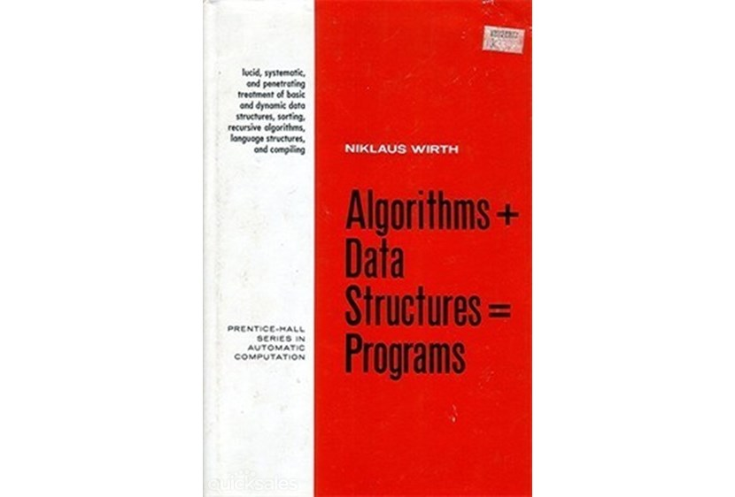
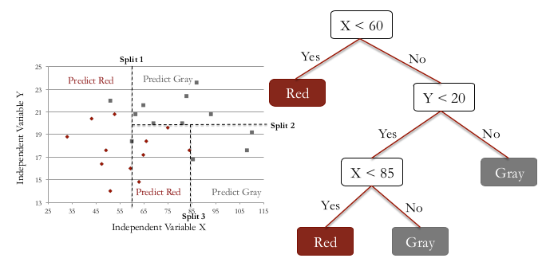

Completed Courses

| Title            | Taught By |
|------------------|----------|
| Machine Learning | Stanford - Andrew Ng |
| Deep Learning    | deeplearning.ai - Andrew Ng |
| Machine Learning With Big Data | Coursera |
| Analytics Edge | MITx - EDX.org |
| Intro to Inferential Statistics | Udacity |
| Intro to Descriptive Statistics | Udacity |
| Introduction to R for Data Science | Datacamp |
| Intro to Python for Data Science | Datacamp |
| Functional Programming in Scala | Coursera |


# Agenda

* Motivation
* Basic Stats
* Machine Learning (small Data)
  + Tools
      - RStudio
      - Jupyter Notebook
      - Zeppelin
      - KNIME
      - Spreadsheet
* ML in Big Data
   - ML in Spark
* Deep Learning
    - Neural Networks
    - Deep Learning for Java (DL4J)


## Motivation - 1

CCA Spark and Hadoop Developer Exam (CCA175)

**Data Ingestion**

Transfer data between external systems and cluster.

  * Import data from database into HDFS using Sqoop
  * Export data to database from HDFS using Sqoop
  * Load data into and out of HDFS

**Transform, Stage, and Store**

Convert data values stored in HDFS into a new data format.

  * Write results from an RDD back into HDFS using Spark
  * Read and write files in a variety of file formats
  * Perform standard ETL processes on data

**Data Analysis**

  + Use Spark SQL.
  + Understand the fundamentals of querying datasets in Spark
  + Filter data using Spark
  + Join disparate datasets using Spark


## Motivation - 2

Big Data Analysis with Scala and Spark

* Week 1. Wikipedia Ranking - Count programming languages
* Week 2. StackOverflow - K Means Cluster - higher voted answers
* Week 3. 
* Week 4. Summarize [American Time Usage Survey] (https://www.kaggle.com/bls/american-time-use-survey) (Dataframe / SQL)

Machine Learning APIs are _not_ covered. 

# Machine Learning Algorithms

**Supervised Learning**

  + Regression
    - *Linear Regression*
    - *Logistic Regression*
  
  + Classification
    - *Classification and Regression Trees*
    - *Naive Bayes*
    - *Support Vector Machine*
  
**Unsupervised Learning**

  + Clustering
    - *Hierarchical Clustering*
    - *K-Means Clustering*


## ML Algorithms & Applications

| Algorithm | Application Examples | Assignments |
|-----------|----------------------|-------------------------------------------------------|
|	Linear Regression |  Wine, Moneyball | Is Climate Change caused by human?, predicting test score, Detecting Flu epidemic via search queries, Predicting Life expectancy from State data |
|	Logistic Regression | Modeling an Expert, The Framingham Heart Study, Election forecasting | Predict popularity of a song, Predicting Parole Violators, Predicting Loan Repayment, Predicting Baseball World Series Champion |
|	Trees	| Predicting Supreme Court Decisions, The D2Hawkeye Story (Predict health care cost) | Social Experiment - Understanding why people vote, Letter recognition, Predict earning from Census data,   |
|	Text Analytics	| Turning Tweets into Knowledge, IBM Watson | Detecting vandalism on Wikipedia, Automating reviews in medicine (is it clinical trial?), seperating Spam, |
|	Clustering	| Recommendation Systems, Predictive Diagnosis | Automatically Tagging blog articles, Market segmentation for Airlines, Predicting stock returns (clustering + regression) |
|	Linear Optimization	| Airline Revenue Management, Radiation Therapy | Investment management, Outsourcing strategy in Italian textiles, Gasoline blending, Farm produce sales strategy |
|	Integer Optimization| Sports Scheduling, eHarmony, operating room scheduler | Selecting profitable hotel sites, Assigning Sales regions, class assignments in elementary school  |

# Data Structures

$Data Structures + Algorithms = Programs$
   Niklaus Wirth


## Basic Calculations

```{r}
8*6
2^16
```

## Functions

```{r}
sqrt(2)
abs(-65)
```

## Variables (Scalar)

``` {r}
SquareRoot2 = sqrt(2)
# or SquareRoot2 <- sqrt(2)

```


## Vectors

```{r}
Country = c("Brazil", "China", "India","Switzerland","USA")
LifeExpectancy = c(74,76,65,83,79)
Country
LifeExpectancy
Country[1]
LifeExpectancy[3]
Sequence = seq(0,100,2)
Sequence
```

## Data Frames

```{r}
CountryData = data.frame(Country, LifeExpectancy) # constructed with vectors
CountryData
CountryData$Population = c(199000,1390000,1240000,7997,318000) # insert new column
CountryData
Country = c("Australia","Greece")
LifeExpectancy = c(82,81)
Population = c(23050,11125)
NewCountryData = data.frame(Country, LifeExpectancy, Population) # construct another DF
#NewCountryData
AllCountryData = rbind(CountryData, NewCountryData) # append
AllCountryData
```


## Loading CSV Files

```{r}

WHO = read.csv("WHO.csv")
str(WHO)
```
## WHO Data Set 

This dataset contains recent statistics about 194 countries from the World
Health Organization (*WHO*).

| Variable | Description |
|----------|---------------------------------|
| *Country* | Country name |
| *Region* | the region the country is in | 
| *Population* | the population of the country in thousands|
| *Under15* | the percentage of the population under 15 years of age |
| *Over60* |the percentage of the population over 60 years of age |
| *FertilityRate* | the average number of children per woman |
| *LifeExpectancy* | the life expectancy in years |
| *CellularSubscribers* | the number of cellular subscribers per 100 population |
| *LiteracyRate* | the literacy rate among adults at least 15 years of age |
| *GNI* | and the gross national income per capita |


## Stats Summary

```{r}
summary(WHO)
```

$$sd = \sqrt{\frac{1}{N-1} \sum_{i=1}^N (x_i - \overline{x})^2}$$

# Basic data analysis

```{r}
#Q:What is the mean value of the "Over60" variable?
mean(WHO$Over60)

#Q:Which country has the smallest percentage of the population over 60?
which.min(WHO$Over60)
WHO$Country[183]

#Q:Which country has the largest literacy rate?
WHO$Country[which.max(WHO$LiteracyRate)]
```

## Vizualization - Histograms

```{r out.extra='style="float:center"'}

hist(WHO$CellularSubscribers)
```

## Vizualization -  Box plot

```{r }
boxplot(WHO$LifeExpectancy ~ WHO$Region,
        xlab = "", ylab = "Life Expectancy",
        main = "Life Expectancy of Countries by Region")

```


## Vizualization -  Summary Tables

```{r}
table(WHO$Region)
tapply(WHO$LifeExpectancy, WHO$Region, mean)
#tapply(WHO$LiteracyRate, WHO$Region, min, na.rm=TRUE)
```

# Linear Regression

$$\hat{y} = a_0 + a_1 * x_1 + a_2 * x_2 + ...$$
```{r}
# best fit line - y = 3x + 2 
x<-c(0,1,1)
y<-c(2,2,8)

plot(x,y,xlim = c(-3,3),ylim = c(0,10),pch=19)

#Baseline prediction
abline(h=mean(y),col="red",lwd=2)
text(-2,5,labels="Y=4,Baseline Prediction",cex=2)

#first fit the Linear model
fit1<-lm(y~x)
abline(lm(y~x),lwd=2,col="blue")
text(1.5,9,labels="Regression Line",cex = 2)


```

## Linear Regression - Correlation

**What is the baseline prediction?**
 
 *4*

**What is the Sum of Squared Errors (SSE) ?**

  *SSE = 0^2 + 3^2 + 3^2 = 18*

**What is the Total Sum of Squares (SST) ?**
 
  *SST = (2 - 4)^2 + (2 - 4)^2 + (8 - 4)^2 = 24*

**What is the R^2 of the model?**
 
  *R^2 = 1 - SSE/SST*
  
  *R^2 = 1 - 18/24 = 0.25.*

## Wine Quality - Data Set

| Variable | Description |
|-----------|-------------------------------------------------------------------------------|  
| Year | The year the wine was produced.|
| Price | A measurement of wine quality computed by Ashenfelter.|
|WinterRain | The amount of winter rain the year the wine was produced, measured in millimeters.|
|AGST | The average growing season temperature the year the wine was produced, measured in degrees Celsius.|
|HarvestRain | The amount of rain during harvest season (August and September) the year the wine was produced, measured in millimeters.|
|Age | The age of the wine, relative to 1983.|
|FrancePop | The population of France the year the wine was produced.|

### Wine Quality - Linear Regression

 [Video] https://www.youtube.com/watch?v=vI3envXmyDs
```{r}

wine = read.csv("Wine.csv")
str(wine)
```

```{r,echo=FALSE}
#plot(Wine)
# quick review
plot(wine$Price ~ wine$AGST)
m1 <- lm(Price ~ AGST, data = wine)
abline(m1)

```{r echo=FALSE}
plot(wine$Price ~ wine$HarvestRain)
m2 <- lm(Price ~ HarvestRain, data = wine)
abline(m2)
```

```{r echo=FALSE}
plot(wine$Price ~ wine$WinterRain)
m3 <- lm(Price ~ WinterRain, data = wine)
abline(m3)

```

### Wine Quality - Summary

```{r}
summary(wine)
```

### Wine Quality - Model 1

```{r}
model1<-lm(Price ~ AGST, data=wine)
summary(model1)

```

### Wine Quality - Model 1 Errors

```{r}
# Sum of Squared Errors
model1$residuals
SSE<-sum(model1$residuals^2)
SSE
```

### Wine Quality - Model 2

```{r}
# Linear Regression (two variables)
model2<-lm(Price ~ AGST + HarvestRain, data=wine)
summary(model2)

# Sum of Squared Errors
SSE<-sum(model2$residuals^2)
SSE
```

### Wine Quality - Model 3

```{r}
# Linear Regression (all variables)
model3<-lm(Price ~ AGST + HarvestRain + WinterRain + Age + FrancePop, data=wine)
summary(model3)

# Sum of Squared Errors
SSE<-sum(model3$residuals^2)
SSE
```

### Wine Quality - Model 4

```{r}
# Remove FrancePop
model4<-lm(Price ~ AGST + HarvestRain + WinterRain + Age, data=wine)
summary(model4)

# Sum of Squared Errors
SSE<-sum(model4$residuals^2)
SSE
```

### Wine Quality - Multicollinearity

```{r}
# Correlations
cor(wine) #correlation matrix 

model5<-lm(Price ~ AGST + HarvestRain + WinterRain, data=wine) # Remove Age and FrancePop as they were highly  correlated
summary(model5)
#removing both Age & FrancePop results in lowering of R-squared. We should remove FrancePop as intuitively Age of Wine is a better predictor of Price of Wine
```

### Wine Quality - Predictions

```{r}
# Read in test set
wineTest<-read.csv("WineTest.csv")
str(wineTest)

# Make test set predictions using predict()
predictTest<-predict(model4, newdata=wineTest)
predictTest

# Compute R-squared
SSE<-sum((wineTest$Price - predictTest)^2)
SST<-sum((wineTest$Price - mean(wine$Price))^2)
1 - SSE/SST
```

# Logistic Regression

 $$P(y=1)=\frac{1}{1 + e^{-(\beta_0 + \beta_1 x_1 + \beta_2 x_2)}}$$
 $$=\frac{1}{1 + e^{-logit}}$$
```{r, echo=FALSE}
logFunc <- function(x) {1 / (1+exp(-x))}
xlab = expression("beta_0 + beta_1*x_1 + beta_2*x_2 + ... + beta_k*x_k")
curve(logFunc, from=-4.5, to=4.5, xlab=xlab, ylab="P(y=1)")
```

## THE FRAMINGHAM HEART STUDY

```{r}
framingham = read.csv("framingham.csv")
# Look at structure
str(framingham)
# Load the library caTools
library(caTools)

# Randomly split the data into training and testing sets
set.seed(1000)
split = sample.split(framingham$TenYearCHD, SplitRatio = 0.65)

# Split up the data using subset
train = subset(framingham, split==TRUE)
test = subset(framingham, split==FALSE)
```

### THE FRAMINGHAM HEART STUDY - Logistic Regression

```{r}
# Logistic Regression Model
framinghamLog = glm(TenYearCHD ~ ., data = train, family=binomial)
summary(framinghamLog)
```

### THE FRAMINGHAM HEART STUDY - Predictions

```{r}
# Predictions on the test set
predictTest = predict(framinghamLog, type="response", newdata=test)

# Confusion matrix with threshold of 0.5
table(test$TenYearCHD, predictTest > 0.5)

# Overall Accuracy of the model
(1069+11)/(1069+6+187+11)

#this needs to be compared with Baseline model
# Baseline accuracy/model
prop.table(table(framingham$TenYearCHD))

#Our model barely beats the baseline model.Is our model worthy?
```

## Modeling the Expert

```{r}
# Read in dataset
quality = read.csv("quality.csv")

# Look at structure
str(quality)

# Table outcome for DV
table(quality$PoorCare)

# Baseline accuracy (in a classification problem, the standard baseline method is to just predict the most frequent outcome for all observations)
98/131
#This is the baseline model which we will try to beat with our logistic model
```

### Modeling the Expert - Data Set

| Variable   | Description         |
|------------|------------------------------------------------------------------------------|
| MemberID | identifying number. |
| InpatientDays | number of inpatient visits, or number of days the person spent in the hospital. |
| ERVisits | number of times the patient visited the emergency room. |
| OfficeVisits | number of times the patient visited any doctor's office. |
| Narcotics | number of prescriptions the patient had for narcotics. |
| DaysSinceLastERVisit | number of days between the patient's last emergency room visit and the end of the study period (set to the length of the study period if they never visited the ER). |
| Pain | number of visits for which the patient complained about pain. |
| TotalVisits | total number of times the patient visited any healthcare provider. |
| ProviderCount | number of providers that served the patient. |
| MedicalClaims | number of days on which the patient had a medical claim. |
| ClaimLines | total number of medical claims. |
| StartedOnCombination | whether or not the patient was started on a combination of drugs to treat their diabetes (TRUE or FALSE). |
| AcuteDrugGapSmall | fraction of acute drugs that were refilled quickly after the prescription ran out. |
| PoorCare | outcome is equal to 1 if the patient had poor care, and equal to 0 if the patient had good care. |


### Modeling the Expert - Visualization

```{r, echo=FALSE}
qualityFilter = quality[quality$PoorCare==1,] # Stores which observations had good care
plot(quality$OfficeVisits, quality$Narcotics, pch=20, cex=2, col="green") # plots all observations in green
points(qualityFilter$OfficeVisits, qualityFilter$Narcotics, col="red", pch=20, cex=2) # plots all observations that had poor care in red 
lines(c(-2,30),c(30,-2), col="blue", lwd=3) # This line helps us to see that above a certain point there seems to be more and more patients with good care.

```

### Modeling the Expert - Split Samples

```{r}
# Install and load caTools package
#install.packages("caTools")
library(caTools)

# Randomly split data
set.seed(88)
split = sample.split(quality$PoorCare, SplitRatio = 0.75) #the DV is split into 75% which we get from baseline accuracy above
split # TRUE means we should put that obs in Training set and FALSE means that obs should be put in testing set

# Create training and testing sets
qualityTrain = subset(quality, split == TRUE)
qualityTest = subset(quality, split == FALSE)

nrow(qualityTrain)
nrow(qualityTest)
```

### Modeling the Expert - Logistic Regression

```{r}

# Logistic Regression Model
QualityLog = glm(PoorCare ~ OfficeVisits + Narcotics, data=qualityTrain, family=binomial)
summary(QualityLog)

# Make predictions on training set
predictTrain = predict(QualityLog, type="response") #type="response" gives us probabilities

# Analyze predictions
summary(predictTrain) # since we are dealing with probabilities, all the nos will be between 0 & 1

#lets see if we are predicting higher probabilities for the actual poorcare cases as we expect
tapply(predictTrain, qualityTrain$PoorCare, mean) #avg prediction for each of the TRUE outcomes

```

### Modeling the Expert - Thresholding

```{r}
# Confusion matrix for threshold of 0.5
table(qualityTrain$PoorCare, predictTrain > 0.5) #first arg is for the rows(true coutcomes) and second arg is for the col labelling(predicted outcomes)

#Sensitivity=TP/total no of positive cases
#specificity=TN/total no of negative cases
c(10/25, 70/74)

table(qualityTrain$PoorCare, predictTrain > 0.7) # Confusion matrix @ threshold of 0.7
c(8/25, 73/74)

table(qualityTrain$PoorCare, predictTrain > 0.2) # Confusion matrix @ threshold of 0.2

# Sensitivity and specificity
c(16/2, 54/74)

#from the above we can see that higher threshold value will have LOWER sensitivity & a HIGHER specificity and lower threshold value will have HIGHER  sensitivity & a LOWER specificity 
#So the big question is how to select the threshold value.

```

### Modeling the Expert - ROC

```{r}
# Install and load ROCR package
#install.packages("ROCR")
library(ROCR)

# Prediction function
ROCRpred = prediction(predictTrain, qualityTrain$PoorCare)

# Performance function
ROCRperf = performance(ROCRpred, "tpr", "fpr") #This defines what we want to plot on x & y axis

# Plot Reciever Operator Characteristic curve
plot(ROCRperf, colorize=TRUE, print.cutoffs.at=seq(0,1,by=0.1), text.adj=c(-0.2,1.7))

```

### Modeling the Expert - Conclusion

**Given this ROC curve, which threshold would you pick if you wanted to correctly identify a small group of patients who are receiving the worst care with high confidence?**

*0.7*

EXPLANATION:The threshold 0.7, since at this threshold we make very few false positive mistakes, and identify about 35% of the true positives.

The threshold t = 0.8 is not a good choice, since it makes about the same number of false positives, but only identifies 10% of the true positives.

The thresholds 0.2 and 0.3 both identify more of the true positives, but they make more false positive mistakes, so our confidence decreases.

**Which threshold would you pick if you wanted to correctly identify half of the patients receiving poor care, while making as few errors as possible?**

*0.3*

EXPLANATION:The threshold 0.3 is the best choice in this scenerio. The threshold 0.2 also identifies over half of the patients receiving poor care, but it makes many more false positive mistakes. The thresholds 0.7 and 0.8 don't identify at least half of the patients receiving poor care.


# Classification and Regression Trees (CART)

This plot shows sample data for two independent variables, _x_ and _y_, and each data point is colored by the outcome variable, red or gray.

CART tries to split this data into subsets so that each subset is as pure or homogeneous as possible.


A _CART_ model is represented by a __tree__.



The first three splits that CART would create are shown here.

Then the standard prediction made by a _CART_ model is just a __majority vote__ within each subset.

Some advantages of _CART_ are that:

* it __does not assume a linear model__, like logistic regression or linear regression, and 
* it is a __very interpretable__ model.


## Predicting Supreme Court Decisions

```{r}
stevens = read.csv("stevens.csv", stringsAsFactor = TRUE)
str(stevens)
```


### Predicting Supreme Court Decisions - Data Set

| Variable | Description |
|----------|------------------------------------------------------------|
| Docket | A unique identifier for each case. |
| Term | The year of the case.|
| Circuit | The circuit court of origin of the case. One of 1st - 11th, Federal, or D.C.|
| Issue | The issue area of the case. Examples are criminal procedure, civil rights, privacy, etc.|
| Petitioner | The type of petitioner in the case. Examples are an employer, an employee, the United States, etc.|
| Respondent | The type of respondent in the case. Examples are an employer, an employee, the United States, etc.|
| LowerCourt | The ideological direction of the lower court ruling, either liberal or conservative.|
| Unconst | Whether or not the petitioner argued that a law or practice is unconstitutional.|
| Reverse | Whether or not Justice Stevens voted to reverse the case.|


### Predicting Supreme Court Decisions - Summary

```{r}
summary(stevens)
```

### Predicting Supreme Court Decisions - Logistic Regression

```{r}
#remove the variables that are not interesting, `Docket` and `Term`.
stevensless <- stevens[, -c(1, 2)]
library(caTools)
set.seed(3000) # to get the same split everytime
spl1 = sample.split(stevensless$Reverse, SplitRatio = 0.7)
Train1 = subset(stevensless, spl1==TRUE)
Test1 = subset(stevensless, spl1==FALSE)

```

### Predicting Supreme Court Decisions - Logistic Regression Summary

```{r}
#Fit _Logistic Regression_ model
#As a reference we also fit a _logistic regression_ model to the _training_ data set:
model_LogRegr <- glm(Reverse ~ ., data = Train1, family = binomial)
summary(model_LogRegr)
```

### Predicting Supreme Court Decisions - Logistic Regression Accuracy

```{r}

#Out-of-Sample predictions of the _Logistic Regression_ model
predict_LogRegr_Test<- predict(model_LogRegr,type = "response", newdata = Test1)
cmat_LR <- table(Test1$Reverse, predict_LogRegr_Test > 0.5)
cmat_LR 

accu_LR <- (cmat_LR[1,1] + cmat_LR[2,2])/sum(cmat_LR)
accu_LR
```

### Predicting Supreme Court Decisions - Sample Split

```{r}
library(caTools)
set.seed(100) # to get the same split everytime
spl1 = sample.split(stevens$Reverse, SplitRatio = 0.7)
StevensTrain = subset(stevens, spl1==TRUE)
StevensTest = subset(stevens, spl1==FALSE)


#install.packages("rpart")
library(rpart)
#install.packages("rpart.plot")
library(rpart.plot)
#install.packages("randomForest")
library(randomForest)
```

### Predicting Supreme Court Decisions - CART

```{r}
StevensTree = rpart(Reverse ~ Circuit + Issue + Petitioner + Respondent + LowerCourt + Unconst, method="class", data =StevensTrain, minbucket=25)

prp(StevensTree)
```

### Predicting Supreme Court Decisions - bucket size selection

```{r}
set.seed(100)
spl = sample.split(StevensTrain$Reverse, SplitRatio = 0.5)
StevensValidateTrain = subset(StevensTrain, spl == TRUE)
StevensValidateTest = subset(StevensTrain, spl == FALSE)

StevensTree1 = rpart(Reverse ~ Circuit + Issue + Petitioner + Respondent + LowerCourt + Unconst, method="class", data = StevensValidateTrain, minbucket=5)
StevensTree2 = rpart(Reverse ~ Circuit + Issue + Petitioner + Respondent + LowerCourt + Unconst, method="class", data = StevensValidateTrain, minbucket=15)
StevensTree3 = rpart(Reverse ~ Circuit + Issue + Petitioner + Respondent + LowerCourt + Unconst, method="class", data = StevensValidateTrain, minbucket=25)

StevensPredict1 = predict(StevensTree1, newdata = StevensValidateTest, type="class")
StevensPredict2 = predict(StevensTree2, newdata = StevensValidateTest, type="class")
StevensPredict3 = predict(StevensTree3, newdata = StevensValidateTest, type="class")
```

### Predicting Supreme Court Decisions - Compare trees

```{r}
table(StevensValidateTest$Reverse, StevensPredict1) # 5
table(StevensValidateTest$Reverse, StevensPredict2) # 15
table(StevensValidateTest$Reverse, StevensPredict3) # 25

```
The best selection for min bucket is 25.

### Predicting Supreme Court Decisions - Final result

```{r}
StevensTreeFinal = rpart(Reverse ~ Circuit + Issue + Petitioner + Respondent + LowerCourt + Unconst, method="class", data =StevensTrain, minbucket=25)
StevensPredictTest = predict(StevensTreeFinal, newdata = StevensTest, type="class")

cmat = table(StevensTest$Reverse, StevensPredictTest)
cmat
c(cmat[1,1] + cmat[2,2], sum(cmat), (cmat[1,1] + cmat[2,2])/sum(cmat))

# StevensPredictTest
```
We end up correctly predicting 112 out of the 170 cases in our test set, for
an accuracy of 65:9%.


# Image Segmentation - Hierarchical Clustring

   [Analytics Edge Course Material] (file:///C:/home/presentations/ml-jaxjug/Unit6_Clustering.html)
```{r}
flower = read.csv("flower.csv", header=FALSE)
str(flower)
```

### Image Segmentation - Data preperation

```{r}
flowerMatrix = as.matrix(flower)
str(flowerMatrix)

image(flowerMatrix,axes=FALSE,col=grey(seq(0,1,length=256)))

# Turn matrix into a vector
flowerVector = as.vector(flowerMatrix)
str(flowerVector)
```

### Image Segmentation - Distances

$$distance(a,b) = \sqrt{\sum_{i=1}^N {(a_i + b_i)^2}} $$

**Genres:**

(unkonwn), Action, Adventure, Animation, Chilren's,

Comedy, Crime, Documnetary, Drama, Fantasy,

Film Noir, Horror, Musical, Mystery, Romance,

Sci-Fi, Thriller, War, Western

Toy Story: (0,0,0,1,1,1,0,0,0,0,0,0,0,0,0,0,0,0,0)

Batman Forever: (0,1,1,0,0,1,1,0,0,0,0,0,0,0,0,0,0,0,0)

$$distnace(Toy Story, Batman Forever) =  \sqrt{(0-0)^2 + (0-1)^2 + (0-1)^2 + (1-0)^2 +  ...} = 15$$

### Image Segmentation - dendrogram

```{r}
#Compute "euclidean" distances

distance = dist(flowerVector, method = "euclidean")
# Hierarchical clustering of the intensity values which is the dendogram tree
clusterIntensity = hclust(distance, method="ward.D2")

#Plot the dendrogram
plot(clusterIntensity)

# Select 3 clusters
#visualising the cuts by plotting a rectangle around the clusters
rect.hclust(clusterIntensity, k = 3, border = "red")
```

### Image Segmentation - Split Clusters

```{r}
#lets split the data into these 3 clusters
flowerClusters = cutree(clusterIntensity, k = 3)
flowerClusters
```

### Image Segmentation - Plot

```{r}
# Find mean intensity values of each of these 3 clusters
tapply(flowerVector, flowerClusters, mean)

# Plot the image and the clusters
#Before plotting the image we want to convert the flowerClusters vector into a matrix of form n x m using dim()
dim(flowerClusters) = c(50,50)
#plotting the image
image(flowerClusters, axes = FALSE)
```

## MRI Image - Analysis

```{r}
# Let's try this with an MRI image of the brain
#healthy.csv dataframe consists of matrix of intensity values 
healthy = read.csv("healthy.csv", header=FALSE)

#Creating the healthy matrix
healthyMatrix = as.matrix(healthy)
str(healthyMatrix)

```

### MRI Image - Healthy Scan

```{r}
#we can see that the image is 566 by 646 ... considerably larger than the flower

# Plot the image in gray scale
image(healthyMatrix,axes=FALSE,col=grey(seq(0,1,length=256)))
```

### MRI Image - # of cacluations

```{r}
# Hierarchial clustering  by computing the distance vector
healthyVector = as.vector(healthyMatrix)
#distance = dist(healthyVector, method = "euclidean")
#throws up error that the vector size is huge 480GB+

# We have an error - why?
#lets see the size of the vector
str(healthyVector)

#Lets  store the value in n
n=365636

#therefore the pairwise distance between each of the above n data points is:
n*(n-1)/2
```

### MRI Image - Create K - Means clusters

```{r}
# Specify number of clusters (Depends upon what you want to extract from the image)
k = 5

# Run k-means
# k means clustering randomly assigns data points to cluster. Set a seed for similar results
 
set.seed(1)

KMC = kmeans(healthyVector, centers = k, iter.max = 1000)
str(KMC)
```

### MRI Image - Plot segmented image

```{r}
# Extract clusters variable for plotting it
healthyClusters = KMC$cluster

# mean intensity values of each clusters is already available under the variable name centers in KMC object
KMC$centers[2] #mean intensity value of 2nd cluster

# Plot the image with the clusters
#first convert into a matrix using dim()
dim(healthyClusters) = c(nrow(healthyMatrix), ncol(healthyMatrix))
image(healthyClusters, axes = FALSE, col=rainbow(k))
```

### MRI Image - Choosing # of Clusters

```{r}

# get the sum of withinss for cluseter size 2 to 10.
NumClusters = seq(2,10,1)
SumWithinss = sapply(2:10, function(x) sum(kmeans(healthyVector, centers=x, iter.max=1000)$withinss))

#SCREE plot
plot(NumClusters, SumWithinss, type="b")
```

### MRI Image - Compare with test image

```{r}
tumor = read.csv("tumor.csv", header=FALSE)
tumorMatrix = as.matrix(tumor)
tumorVector = as.vector(tumorMatrix)

#Apply clusters from before to new image, using the flexclust package
#install.packages("flexclust")
library(flexclust)

#converting KMC into kcca object
KMC.kcca = as.kcca(KMC, healthyVector) #Healthy vector as a training set
tumorClusters = predict(KMC.kcca, newdata = tumorVector) #tumorvector as a testing set

#Visualize the clusters

#converting tumorClusters into a matrix
dim(tumorClusters) = c(nrow(tumorMatrix), ncol(tumorMatrix))

#visualising the tumorClusters
image(tumorClusters, axes = FALSE, col=rainbow(k))
```

# Big Data (pySpark)

   [PySpark code] (file:///C:/home/presentations/ml-jaxjug/classification.py)


## pySpark - compared to R

```{r}
weather = read.csv("daily_weather.csv")

#str(weather)
#summary(weather)
weather$low_humidity_day = as.numeric(weather$relative_humidity_3pm < 25)

library(caTools)
library(rpart)
library(rpart.plot)

set.seed(12345) # to get the same split everytime
spl = sample.split(weather$low_humidity_day, SplitRatio = 0.8)
train = subset(weather, spl==TRUE)
test = subset(weather, spl==FALSE)

weatherTree = rpart(low_humidity_day ~ air_pressure_9am + air_temp_9am + avg_wind_direction_9am + avg_wind_speed_9am + max_wind_direction_9am + max_wind_speed_9am + rain_accumulation_9am + rain_duration_9am, data=weather, method="class", minbucket=20)
# prp(weatherTree)

predictWeather = predict(weatherTree, newdata = test, type="class")
cmat = table(test$low_humidity_day, predictWeather)
cmat
(cmat[1,1] + cmat[2,2])/sum(cmat)
```

# Acknowledgement


**Analytics Edge** https://www.edx.org/course/analytics-edge-mitx-15-071x-3

**Analytics Vidhya - learning plan** https://www.analyticsvidhya.com/blog/2017/01/the-most-comprehensive-data-science-learning-plan-for-2017/

**KNIME** https://www.knime.com/

# What's Next


**Deep Learning**

# The End

Thank You
