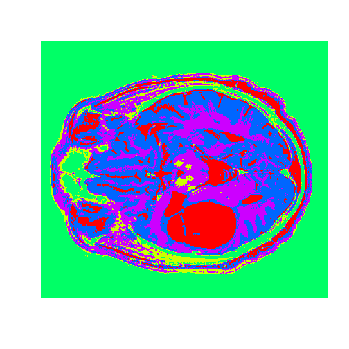

Data Science for Developers
========================================================
author: Padhu Ramalingam @pramalin
date: September 6th 2017
autosize: true

<style>
.reveal .slides section .slideContent {
   font-size: 20px;
}
</style>

Agenda
========================================================
* Motivation
* Basic Stats
* Machine Learning (small Data)
  + Tools
      - RStudio
      - Jupyter Notebook
      - Zeppelin
      - KNIME
      - Spreadsheet
  
* ML in Big Data
   - ML in Spark
   
* Deep Learning
    - Neural Networks
    - Deep Learning for Java (DL4J)


Motivation - 1
========================================================

CCA Spark and Hadoop Developer Exam (CCA175)

### Data Ingest
Transfer data between external systems and cluster.
  + Import data from database into HDFS using Sqoop
  + Export data to database from HDFS using Sqoop
  + Load data into and out of HDFS

### Transform, Stage, and Store
Convert data values stored in HDFS into a new data format.
  + Write results from an RDD back into HDFS using Spark
  + Read and write files in a variety of file formats
  + Perform standard ETL processes on data

### Data Analysis
Use Spark SQL.
  + Understand the fundamentals of querying datasets in Spark
  + Filter data using Spark
  + Join disparate datasets using Spark


Motivation - 2
========================================================
Big Data Analysis with Scala and Spark

* Week 1. Wikipedia Ranking - Count programming languages
* Week 2. StackOverflow - K Means Cluster - higher voted answers
* Week 3. 
* Week 4. Summarize [American Time Usage Survey] (https://www.kaggle.com/bls/american-time-use-survey) (Dataframe / SQL)

Machine Learning APIs are _not_ covered. 

Machine Learning Algorithms
========================================================
**Supervised Learning**
  + Regression
    - *Linear Regression*
    - *Logistic Regression*
  
  + Classification
    - *Classification and Regression Trees*
    - *Naive Bayes*
    - *Support Vector Machine*
  
**Unsupervised Learning**
  + Clustering
    - *Hierarchical Clustering*
    - *K-Means Clustering*


ML Algorithms & Applications
========================================================

| Algorithm | Application Examples | Assignments |
|-----------|----------------------|-------------|
|	Linear Regression |  Wine, Moneyball | Is Climate Change caused by human, predicting test score, Detecting Flu epidemic via search queries, Predicting Life expectancy from State data |
|	Logistic Regression | Modeling an Expert, The Framingham Heart Study, Election forecasting | Predict popularity of a song, Predicting Parole Violators, Predicting Loan Repayment, Predicting Baseball World Series Champion |
|	Trees	| Predicting Supreme Court Decisions, The D2Hawkeye Story (Predict health care cost) | Social Experiment - Understanding why people vote, Letter recognition, Predict earning from Census data,   |
|	Text Analytics	| Turning Tweets into Knowledge, IBM Watson | Detecting vandalism on Wikipedia, Automating reviews in medicine (is it clinical trial?), seperating Spam, |
|	Clustering	| Recommendation Systems, Predictive Diagnosis | Automatically Tagging blog articles, Market segmentation for Airlines, Predicting stock returns (clustering + regression) |
|	Linear Optimization	| Airline Revenue Management, Radiation Therapy | Investment management, Outsourcing strategy in Italian textiles, Gasoline blending, Farm produce sales strategy |
|	Integer Optimization| Sports Scheduling, eHarmony, operating room scheduler | Selecting profitable hotel sites, Assigning Sales regions, class assignments in elementary school  |

Data Structures
========================================================

# $Data Structures + Algorithms = Programs$
   Niklaus Wirth


Basic Calculations
========================================================

```r
8*6
```

```
[1] 48
```

```r
2^16
```

```
[1] 65536
```

Functions
========================================================

```r
sqrt(2)
```

```
[1] 1.414214
```

```r
abs(-65)
```

```
[1] 65
```

Variables (Scalar)
========================================================

```r
SquareRoot2 = sqrt(2)
# or SquareRoot2 <- sqrt(2)
```


Vectors
========================================================

```r
Country = c("Brazil", "China", "India","Switzerland","USA")
LifeExpectancy = c(74,76,65,83,79)
Country
```

```
[1] "Brazil"      "China"       "India"       "Switzerland" "USA"        
```

```r
LifeExpectancy
```

```
[1] 74 76 65 83 79
```

```r
Country[1]
```

```
[1] "Brazil"
```

```r
LifeExpectancy[3]
```

```
[1] 65
```

```r
Sequence = seq(0,100,2)
Sequence
```

```
 [1]   0   2   4   6   8  10  12  14  16  18  20  22  24  26  28  30  32
[18]  34  36  38  40  42  44  46  48  50  52  54  56  58  60  62  64  66
[35]  68  70  72  74  76  78  80  82  84  86  88  90  92  94  96  98 100
```

Data Frames
========================================================

```r
CountryData = data.frame(Country, LifeExpectancy) # constructed with vectors
CountryData
```

```
      Country LifeExpectancy
1      Brazil             74
2       China             76
3       India             65
4 Switzerland             83
5         USA             79
```

```r
CountryData$Population = c(199000,1390000,1240000,7997,318000) # insert new column
CountryData
```

```
      Country LifeExpectancy Population
1      Brazil             74     199000
2       China             76    1390000
3       India             65    1240000
4 Switzerland             83       7997
5         USA             79     318000
```

```r
Country = c("Australia","Greece")
LifeExpectancy = c(82,81)
Population = c(23050,11125)
NewCountryData = data.frame(Country, LifeExpectancy, Population) # construct another DF
#NewCountryData
AllCountryData = rbind(CountryData, NewCountryData) # append
AllCountryData
```

```
      Country LifeExpectancy Population
1      Brazil             74     199000
2       China             76    1390000
3       India             65    1240000
4 Switzerland             83       7997
5         USA             79     318000
6   Australia             82      23050
7      Greece             81      11125
```


Loading CSV Files
========================================================


```r
WHO = read.csv("WHO.csv")
str(WHO)
```

```
'data.frame':	194 obs. of  10 variables:
 $ Country            : Factor w/ 194 levels "Afghanistan",..: 1 2 3 4 5 6 7 8 9 10 ...
 $ Region             : Factor w/ 6 levels "Africa","Americas",..: 3 4 1 4 1 2 2 4 6 4 ...
 $ Population         : int  29825 3162 38482 78 20821 89 41087 2969 23050 8464 ...
 $ Under15            : num  47.4 21.3 27.4 15.2 47.6 ...
 $ Over60             : num  3.82 14.93 7.17 22.86 3.84 ...
 $ FertilityRate      : num  5.4 1.75 2.83 NA 6.1 2.12 2.2 1.74 1.89 1.44 ...
 $ LifeExpectancy     : int  60 74 73 82 51 75 76 71 82 81 ...
 $ CellularSubscribers: num  54.3 96.4 99 75.5 48.4 ...
 $ LiteracyRate       : num  NA NA NA NA 70.1 99 97.8 99.6 NA NA ...
 $ GNI                : num  1140 8820 8310 NA 5230 ...
```
WHO Data Set 
========================================================
This dataset contains recent statistics about 194 countries from the World
Health Organization (*WHO*).

| Variable | Descreption |
|----------|---------------------------------|
| *Country* | Country name |
| *Region* | the region the country is in | 
| *Population* | the population of the country in thousands|
| *Under15* | the percentage of the population under 15 years of age |
| *Over60* |the percentage of the population over 60 years of age |
| *FertilityRate* | the average number of children per woman |
| *LifeExpectancy* | the life expectancy in years |
| *CellularSubscribers* | the number of cellular subscribers per 100 population |
| *LiteracyRate* | the literacy rate among adults at least 15 years of age |
| *GNI* | and the gross national income per capita |


Stats Summary
========================================================


```r
summary(WHO)
```

```
                Country                      Region     Population     
 Afghanistan        :  1   Africa               :46   Min.   :      1  
 Albania            :  1   Americas             :35   1st Qu.:   1696  
 Algeria            :  1   Eastern Mediterranean:22   Median :   7790  
 Andorra            :  1   Europe               :53   Mean   :  36360  
 Angola             :  1   South-East Asia      :11   3rd Qu.:  24535  
 Antigua and Barbuda:  1   Western Pacific      :27   Max.   :1390000  
 (Other)            :188                                               
    Under15          Over60      FertilityRate   LifeExpectancy 
 Min.   :13.12   Min.   : 0.81   Min.   :1.260   Min.   :47.00  
 1st Qu.:18.72   1st Qu.: 5.20   1st Qu.:1.835   1st Qu.:64.00  
 Median :28.65   Median : 8.53   Median :2.400   Median :72.50  
 Mean   :28.73   Mean   :11.16   Mean   :2.941   Mean   :70.01  
 3rd Qu.:37.75   3rd Qu.:16.69   3rd Qu.:3.905   3rd Qu.:76.00  
 Max.   :49.99   Max.   :31.92   Max.   :7.580   Max.   :83.00  
                                 NA's   :11                     
 CellularSubscribers  LiteracyRate        GNI       
 Min.   :  2.57      Min.   :31.10   Min.   :  340  
 1st Qu.: 63.57      1st Qu.:71.60   1st Qu.: 2335  
 Median : 97.75      Median :91.80   Median : 7870  
 Mean   : 93.64      Mean   :83.71   Mean   :13321  
 3rd Qu.:120.81      3rd Qu.:97.85   3rd Qu.:17558  
 Max.   :196.41      Max.   :99.80   Max.   :86440  
 NA's   :10          NA's   :91      NA's   :32     
```

## $$sd = \sqrt{\frac{1}{N-1} \sum_{i=1}^N (x_i - \overline{x})^2}$$

Basic data analysis
========================================================

```r
#Q:What is the mean value of the "Over60" variable?
mean(WHO$Over60)
```

```
[1] 11.16366
```

```r
#Q:Which country has the smallest percentage of the population over 60?
which.min(WHO$Over60)
```

```
[1] 183
```

```r
WHO$Country[183]
```

```
[1] United Arab Emirates
194 Levels: Afghanistan Albania Algeria Andorra ... Zimbabwe
```

```r
#Q:Which country has the largest literacy rate?
WHO$Country[which.max(WHO$LiteracyRate)]
```

```
[1] Cuba
194 Levels: Afghanistan Albania Algeria Andorra ... Zimbabwe
```
Vizualization - Histograms
========================================================

```r
hist(WHO$CellularSubscribers)
```


Vizualization -  Box plot
========================================================

```r
boxplot(WHO$LifeExpectancy ~ WHO$Region, xlab = "", ylab = "Life Expectancy", main = "Life Expectancy of Countries by Region")
```


Vizualization -  Summary Tables
========================================================

```r
table(WHO$Region)
```

```

               Africa              Americas Eastern Mediterranean 
                   46                    35                    22 
               Europe       South-East Asia       Western Pacific 
                   53                    11                    27 
```

```r
tapply(WHO$LifeExpectancy, WHO$Region, mean)
```

```
               Africa              Americas Eastern Mediterranean 
             57.95652              74.34286              69.59091 
               Europe       South-East Asia       Western Pacific 
             76.73585              69.36364              72.33333 
```

```r
#tapply(WHO$LiteracyRate, WHO$Region, min, na.rm=TRUE)
```

Linear Regression
========================================================
# $$\hat{y} = a_0 + a_1 * x_1 + a_2 * x_2 + ...$$

```r
# best fit line - y = 3x + 2 
x<-c(0,1,1)
y<-c(2,2,8)

plot(x,y,xlim = c(-3,3),ylim = c(0,10),pch=19)

#Baseline prediction
abline(h=mean(y),col="red",lwd=2)
text(-2,5,labels="Y=4,Baseline Prediction",cex=2)

#first fit the Linear model
fit1<-lm(y~x)
abline(lm(y~x),lwd=2,col="blue")
text(1.5,9,labels="Regression Line",cex = 2)
```


Linear Regression - Correlation
========================================================

**What is the baseline prediction?**
 
 *4*

**What is the Sum of Squared Errors (SSE) ?**

  *SSE = 0^2 + 3^2 + 3^2 = 18*

**What is the Total Sum of Squares (SST) ?**
 
  *SST = (2 - 4)^2 + (2 - 4)^2 + (8 - 4)^2 = 24*

**What is the R^2 of the model?**
 
  *R^2 = 1 - SSE/SST*
  
  *R^2 = 1 - 18/24 = 0.25.*

Wine Quality - Data Set
========================================================
| Variable | Description |
|-----------|----------------------------------------|  
| Year | The year the wine was produced.|
| Price | A measurement of wine quality computed by Ashenfelter.|
|WinterRain | The amount of winter rain the year the wine was produced, measured in millimeters.|
|AGST | The average growing season temperature the year the wine was produced, measured in degrees Celsius.|
|HarvestRain | The amount of rain during harvest season (August and September) the year the wine was produced, measured in millimeters.|
|Age | The age of the wine, relative to 1983.|
|FrancePop | The population of France the year the wine was produced.|

Wine Quality - Linear Regression
========================================================
 [Video] https://www.youtube.com/watch?v=vI3envXmyDs

```r
wine = read.csv("Wine.csv")
str(wine)
```

```
'data.frame':	25 obs. of  7 variables:
 $ Year       : int  1952 1953 1955 1957 1958 1959 1960 1961 1962 1963 ...
 $ Price      : num  7.5 8.04 7.69 6.98 6.78 ...
 $ WinterRain : int  600 690 502 420 582 485 763 830 697 608 ...
 $ AGST       : num  17.1 16.7 17.1 16.1 16.4 ...
 $ HarvestRain: int  160 80 130 110 187 187 290 38 52 155 ...
 $ Age        : int  31 30 28 26 25 24 23 22 21 20 ...
 $ FrancePop  : num  43184 43495 44218 45152 45654 ...
```


Wine Quality - Summary
========================================================

```r
summary(wine)
```

```
      Year          Price         WinterRain         AGST      
 Min.   :1952   Min.   :6.205   Min.   :376.0   Min.   :14.98  
 1st Qu.:1960   1st Qu.:6.519   1st Qu.:536.0   1st Qu.:16.20  
 Median :1966   Median :7.121   Median :600.0   Median :16.53  
 Mean   :1966   Mean   :7.067   Mean   :605.3   Mean   :16.51  
 3rd Qu.:1972   3rd Qu.:7.495   3rd Qu.:697.0   3rd Qu.:17.07  
 Max.   :1978   Max.   :8.494   Max.   :830.0   Max.   :17.65  
  HarvestRain         Age         FrancePop    
 Min.   : 38.0   Min.   : 5.0   Min.   :43184  
 1st Qu.: 89.0   1st Qu.:11.0   1st Qu.:46584  
 Median :130.0   Median :17.0   Median :50255  
 Mean   :148.6   Mean   :17.2   Mean   :49694  
 3rd Qu.:187.0   3rd Qu.:23.0   3rd Qu.:52894  
 Max.   :292.0   Max.   :31.0   Max.   :54602  
```

Wine Quality - Model 1
========================================================

```r
model1<-lm(Price ~ AGST, data=wine)
summary(model1)
```

```

Call:
lm(formula = Price ~ AGST, data = wine)

Residuals:
     Min       1Q   Median       3Q      Max 
-0.78450 -0.23882 -0.03727  0.38992  0.90318 

Coefficients:
            Estimate Std. Error t value Pr(>|t|)    
(Intercept)  -3.4178     2.4935  -1.371 0.183710    
AGST          0.6351     0.1509   4.208 0.000335 ***
---
Signif. codes:  0 '***' 0.001 '**' 0.01 '*' 0.05 '.' 0.1 ' ' 1

Residual standard error: 0.4993 on 23 degrees of freedom
Multiple R-squared:  0.435,	Adjusted R-squared:  0.4105 
F-statistic: 17.71 on 1 and 23 DF,  p-value: 0.000335
```

Wine Quality - Model 1 Errors
========================================================

```r
# Sum of Squared Errors
model1$residuals
```

```
          1           2           3           4           5           6 
 0.04204258  0.82983774  0.21169394  0.15609432 -0.23119140  0.38991701 
          7           8           9          10          11          12 
-0.48959140  0.90318115  0.45372410  0.14887461 -0.23882157 -0.08974238 
         13          14          15          16          17          18 
 0.66185660 -0.05211511 -0.62726647 -0.74714947  0.42113502 -0.03727441 
         19          20          21          22          23          24 
 0.10685278 -0.78450270 -0.64017590 -0.05508720 -0.67055321 -0.22040381 
         25 
 0.55866518 
```

```r
SSE<-sum(model1$residuals^2)
SSE
```

```
[1] 5.734875
```

Wine Quality - Model 2
========================================================

```r
# Linear Regression (two variables)
model2<-lm(Price ~ AGST + HarvestRain, data=wine)
summary(model2)
```

```

Call:
lm(formula = Price ~ AGST + HarvestRain, data = wine)

Residuals:
     Min       1Q   Median       3Q      Max 
-0.88321 -0.19600  0.06178  0.15379  0.59722 

Coefficients:
            Estimate Std. Error t value Pr(>|t|)    
(Intercept) -2.20265    1.85443  -1.188 0.247585    
AGST         0.60262    0.11128   5.415 1.94e-05 ***
HarvestRain -0.00457    0.00101  -4.525 0.000167 ***
---
Signif. codes:  0 '***' 0.001 '**' 0.01 '*' 0.05 '.' 0.1 ' ' 1

Residual standard error: 0.3674 on 22 degrees of freedom
Multiple R-squared:  0.7074,	Adjusted R-squared:  0.6808 
F-statistic: 26.59 on 2 and 22 DF,  p-value: 1.347e-06
```

```r
# Sum of Squared Errors
SSE<-sum(model2$residuals^2)
SSE
```

```
[1] 2.970373
```

Wine Quality - Model 3
========================================================

```r
# Linear Regression (all variables)
model3<-lm(Price ~ AGST + HarvestRain + WinterRain + Age + FrancePop, data=wine)
summary(model3)
```

```

Call:
lm(formula = Price ~ AGST + HarvestRain + WinterRain + Age + 
    FrancePop, data = wine)

Residuals:
     Min       1Q   Median       3Q      Max 
-0.48179 -0.24662 -0.00726  0.22012  0.51987 

Coefficients:
              Estimate Std. Error t value Pr(>|t|)    
(Intercept) -4.504e-01  1.019e+01  -0.044 0.965202    
AGST         6.012e-01  1.030e-01   5.836 1.27e-05 ***
HarvestRain -3.958e-03  8.751e-04  -4.523 0.000233 ***
WinterRain   1.043e-03  5.310e-04   1.963 0.064416 .  
Age          5.847e-04  7.900e-02   0.007 0.994172    
FrancePop   -4.953e-05  1.667e-04  -0.297 0.769578    
---
Signif. codes:  0 '***' 0.001 '**' 0.01 '*' 0.05 '.' 0.1 ' ' 1

Residual standard error: 0.3019 on 19 degrees of freedom
Multiple R-squared:  0.8294,	Adjusted R-squared:  0.7845 
F-statistic: 18.47 on 5 and 19 DF,  p-value: 1.044e-06
```

```r
# Sum of Squared Errors
SSE<-sum(model3$residuals^2)
SSE
```

```
[1] 1.732113
```

Wine Quality - Model 4
========================================================

```r
# Remove FrancePop
model4<-lm(Price ~ AGST + HarvestRain + WinterRain + Age, data=wine)
summary(model4)
```

```

Call:
lm(formula = Price ~ AGST + HarvestRain + WinterRain + Age, data = wine)

Residuals:
     Min       1Q   Median       3Q      Max 
-0.45470 -0.24273  0.00752  0.19773  0.53637 

Coefficients:
              Estimate Std. Error t value Pr(>|t|)    
(Intercept) -3.4299802  1.7658975  -1.942 0.066311 .  
AGST         0.6072093  0.0987022   6.152  5.2e-06 ***
HarvestRain -0.0039715  0.0008538  -4.652 0.000154 ***
WinterRain   0.0010755  0.0005073   2.120 0.046694 *  
Age          0.0239308  0.0080969   2.956 0.007819 ** 
---
Signif. codes:  0 '***' 0.001 '**' 0.01 '*' 0.05 '.' 0.1 ' ' 1

Residual standard error: 0.295 on 20 degrees of freedom
Multiple R-squared:  0.8286,	Adjusted R-squared:  0.7943 
F-statistic: 24.17 on 4 and 20 DF,  p-value: 2.036e-07
```

```r
# Sum of Squared Errors
SSE<-sum(model4$residuals^2)
SSE
```

```
[1] 1.740162
```
Wine Quality - Multicollinearity
========================================================

```r
# Correlations
cor(wine) #correlation matrix 
```

```
                   Year      Price   WinterRain        AGST HarvestRain
Year         1.00000000 -0.4477679  0.016970024 -0.24691585  0.02800907
Price       -0.44776786  1.0000000  0.136650547  0.65956286 -0.56332190
WinterRain   0.01697002  0.1366505  1.000000000 -0.32109061 -0.27544085
AGST        -0.24691585  0.6595629 -0.321090611  1.00000000 -0.06449593
HarvestRain  0.02800907 -0.5633219 -0.275440854 -0.06449593  1.00000000
Age         -1.00000000  0.4477679 -0.016970024  0.24691585 -0.02800907
FrancePop    0.99448510 -0.4668616 -0.001621627 -0.25916227  0.04126439
                    Age    FrancePop
Year        -1.00000000  0.994485097
Price        0.44776786 -0.466861641
WinterRain  -0.01697002 -0.001621627
AGST         0.24691585 -0.259162274
HarvestRain -0.02800907  0.041264394
Age          1.00000000 -0.994485097
FrancePop   -0.99448510  1.000000000
```

```r
model5<-lm(Price ~ AGST + HarvestRain + WinterRain, data=wine) # Remove Age and FrancePop as they were highly  correlated
summary(model5)
```

```

Call:
lm(formula = Price ~ AGST + HarvestRain + WinterRain, data = wine)

Residuals:
     Min       1Q   Median       3Q      Max 
-0.67472 -0.12958  0.01973  0.20751  0.63846 

Coefficients:
              Estimate Std. Error t value Pr(>|t|)    
(Intercept) -4.3016263  2.0366743  -2.112 0.046831 *  
AGST         0.6810242  0.1117011   6.097 4.75e-06 ***
HarvestRain -0.0039481  0.0009987  -3.953 0.000726 ***
WinterRain   0.0011765  0.0005920   1.987 0.060097 .  
---
Signif. codes:  0 '***' 0.001 '**' 0.01 '*' 0.05 '.' 0.1 ' ' 1

Residual standard error: 0.345 on 21 degrees of freedom
Multiple R-squared:  0.7537,	Adjusted R-squared:  0.7185 
F-statistic: 21.42 on 3 and 21 DF,  p-value: 1.359e-06
```

```r
#removing both Age & FrancePop results in lowering of R-squared. We should remove FrancePop as intuitively Age of Wine is a better predictor of Price of Wine
```

Wine Quality - Predictions
========================================================

```r
# Read in test set
wineTest<-read.csv("WineTest.csv")
str(wineTest)
```

```
'data.frame':	2 obs. of  7 variables:
 $ Year       : int  1979 1980
 $ Price      : num  6.95 6.5
 $ WinterRain : int  717 578
 $ AGST       : num  16.2 16
 $ HarvestRain: int  122 74
 $ Age        : int  4 3
 $ FrancePop  : num  54836 55110
```

```r
# Make test set predictions using predict()
predictTest<-predict(model4, newdata=wineTest)
predictTest
```

```
       1        2 
6.768925 6.684910 
```

```r
# Compute R-squared
SSE<-sum((wineTest$Price - predictTest)^2)
SST<-sum((wineTest$Price - mean(wine$Price))^2)
1 - SSE/SST
```

```
[1] 0.7944278
```

Logistic Regression
========================================================

## $$P(y=1)=\frac{1}{1 + e^{-(\beta_0 + \beta_1 x_1 + \beta_2 x_2)}}$$
## $$=\frac{1}{1 + e^{-logit}}$$


THE FRAMINGHAM HEART STUDY
========================================================

```r
framingham = read.csv("framingham.csv")
# Look at structure
str(framingham)
```

```
'data.frame':	4240 obs. of  16 variables:
 $ male           : int  1 0 1 0 0 0 0 0 1 1 ...
 $ age            : int  39 46 48 61 46 43 63 45 52 43 ...
 $ education      : int  4 2 1 3 3 2 1 2 1 1 ...
 $ currentSmoker  : int  0 0 1 1 1 0 0 1 0 1 ...
 $ cigsPerDay     : int  0 0 20 30 23 0 0 20 0 30 ...
 $ BPMeds         : int  0 0 0 0 0 0 0 0 0 0 ...
 $ prevalentStroke: int  0 0 0 0 0 0 0 0 0 0 ...
 $ prevalentHyp   : int  0 0 0 1 0 1 0 0 1 1 ...
 $ diabetes       : int  0 0 0 0 0 0 0 0 0 0 ...
 $ totChol        : int  195 250 245 225 285 228 205 313 260 225 ...
 $ sysBP          : num  106 121 128 150 130 ...
 $ diaBP          : num  70 81 80 95 84 110 71 71 89 107 ...
 $ BMI            : num  27 28.7 25.3 28.6 23.1 ...
 $ heartRate      : int  80 95 75 65 85 77 60 79 76 93 ...
 $ glucose        : int  77 76 70 103 85 99 85 78 79 88 ...
 $ TenYearCHD     : int  0 0 0 1 0 0 1 0 0 0 ...
```

```r
# Load the library caTools
library(caTools)

# Randomly split the data into training and testing sets
set.seed(1000)
split = sample.split(framingham$TenYearCHD, SplitRatio = 0.65)

# Split up the data using subset
train = subset(framingham, split==TRUE)
test = subset(framingham, split==FALSE)
```
THE FRAMINGHAM HEART STUDY - Logistic Regression
========================================================

```r
# Logistic Regression Model
framinghamLog = glm(TenYearCHD ~ ., data = train, family=binomial)
summary(framinghamLog)
```

```

Call:
glm(formula = TenYearCHD ~ ., family = binomial, data = train)

Deviance Residuals: 
    Min       1Q   Median       3Q      Max  
-1.8487  -0.6007  -0.4257  -0.2842   2.8369  

Coefficients:
                 Estimate Std. Error z value Pr(>|z|)    
(Intercept)     -7.886574   0.890729  -8.854  < 2e-16 ***
male             0.528457   0.135443   3.902 9.55e-05 ***
age              0.062055   0.008343   7.438 1.02e-13 ***
education       -0.058923   0.062430  -0.944  0.34525    
currentSmoker    0.093240   0.194008   0.481  0.63080    
cigsPerDay       0.015008   0.007826   1.918  0.05514 .  
BPMeds           0.311221   0.287408   1.083  0.27887    
prevalentStroke  1.165794   0.571215   2.041  0.04126 *  
prevalentHyp     0.315818   0.171765   1.839  0.06596 .  
diabetes        -0.421494   0.407990  -1.033  0.30156    
totChol          0.003835   0.001377   2.786  0.00533 ** 
sysBP            0.011344   0.004566   2.485  0.01297 *  
diaBP           -0.004740   0.008001  -0.592  0.55353    
BMI              0.010723   0.016157   0.664  0.50689    
heartRate       -0.008099   0.005313  -1.524  0.12739    
glucose          0.008935   0.002836   3.150  0.00163 ** 
---
Signif. codes:  0 '***' 0.001 '**' 0.01 '*' 0.05 '.' 0.1 ' ' 1

(Dispersion parameter for binomial family taken to be 1)

    Null deviance: 2020.7  on 2384  degrees of freedom
Residual deviance: 1792.3  on 2369  degrees of freedom
  (371 observations deleted due to missingness)
AIC: 1824.3

Number of Fisher Scoring iterations: 5
```

THE FRAMINGHAM HEART STUDY - Predictions
========================================================

```r
# Predictions on the test set
predictTest = predict(framinghamLog, type="response", newdata=test)

# Confusion matrix with threshold of 0.5
table(test$TenYearCHD, predictTest > 0.5)
```

```
   
    FALSE TRUE
  0  1069    6
  1   187   11
```

```r
# Overall Accuracy of the model
(1069+11)/(1069+6+187+11)
```

```
[1] 0.8483896
```

```r
#this needs to be compared with Baseline model
# Baseline accuracy/model
prop.table(table(framingham$TenYearCHD))
```

```

        0         1 
0.8481132 0.1518868 
```

```r
#Our model barely beats the baseline model.Is our model worthy?
```

Modeling the Expert
========================================================

```r
# Read in dataset
quality = read.csv("quality.csv")

# Look at structure
str(quality)
```

```
'data.frame':	131 obs. of  14 variables:
 $ MemberID            : int  1 2 3 4 5 6 7 8 9 10 ...
 $ InpatientDays       : int  0 1 0 0 8 2 16 2 2 4 ...
 $ ERVisits            : int  0 1 0 1 2 0 1 0 1 2 ...
 $ OfficeVisits        : int  18 6 5 19 19 9 8 8 4 0 ...
 $ Narcotics           : int  1 1 3 0 3 2 1 0 3 2 ...
 $ DaysSinceLastERVisit: num  731 411 731 158 449 ...
 $ Pain                : int  10 0 10 34 10 6 4 5 5 2 ...
 $ TotalVisits         : int  18 8 5 20 29 11 25 10 7 6 ...
 $ ProviderCount       : int  21 27 16 14 24 40 19 11 28 21 ...
 $ MedicalClaims       : int  93 19 27 59 51 53 40 28 20 17 ...
 $ ClaimLines          : int  222 115 148 242 204 156 261 87 98 66 ...
 $ StartedOnCombination: logi  FALSE FALSE FALSE FALSE FALSE FALSE ...
 $ AcuteDrugGapSmall   : int  0 1 5 0 0 4 0 0 0 0 ...
 $ PoorCare            : int  0 0 0 0 0 1 0 0 1 0 ...
```

```r
# Table outcome for DV
table(quality$PoorCare)
```

```

 0  1 
98 33 
```

```r
# Baseline accuracy (in a classification problem, the standard baseline method is to just predict the most frequent outcome for all observations)
98/131
```

```
[1] 0.7480916
```

```r
#This is the baseline model which we will try to beat with our logistic model
```
Modeling the Expert - Data Set
========================================================
| Variable   | Description         |
|------------|------------------------------------|
| MemberID | identifying number. |
| InpatientDays | number of inpatient visits, or number of days the person spent in the hospital. |
| ERVisits | number of times the patient visited the emergency room. |
| OfficeVisits | number of times the patient visited any doctor's office. |
| Narcotics | number of prescriptions the patient had for narcotics. |
| DaysSinceLastERVisit | number of days between the patient's last emergency room visit and the end of the study period (set to the length of the study period if they never visited the ER). |
| Pain | number of visits for which the patient complained about pain. |
| TotalVisits | total number of times the patient visited any healthcare provider. |
| ProviderCount | number of providers that served the patient. |
| MedicalClaims | number of days on which the patient had a medical claim. |
| ClaimLines | total number of medical claims. |
| StartedOnCombination | whether or not the patient was started on a combination of drugs to treat their diabetes (TRUE or FALSE). |
| AcuteDrugGapSmall | fraction of acute drugs that were refilled quickly after the prescription ran out. |
| PoorCare | outcome is equal to 1 if the patient had poor care, and equal to 0 if the patient had good care. |

Modeling the Expert - Visualization
========================================================

Modeling the Expert - Split Samples
========================================================

```r
# Install and load caTools package
#install.packages("caTools")
library(caTools)

# Randomly split data
set.seed(88)
split = sample.split(quality$PoorCare, SplitRatio = 0.75) #the DV is split into 75% which we get from baseline accuracy above
split # TRUE means we should put that obs in Training set and FALSE means that obs should be put in testing set
```

```
  [1]  TRUE  TRUE  TRUE  TRUE FALSE  TRUE FALSE  TRUE FALSE FALSE  TRUE
 [12] FALSE  TRUE  TRUE  TRUE  TRUE  TRUE  TRUE  TRUE  TRUE  TRUE  TRUE
 [23]  TRUE  TRUE FALSE  TRUE  TRUE  TRUE  TRUE FALSE FALSE FALSE FALSE
 [34]  TRUE  TRUE  TRUE FALSE  TRUE  TRUE  TRUE FALSE FALSE  TRUE  TRUE
 [45] FALSE  TRUE FALSE  TRUE FALSE  TRUE  TRUE FALSE FALSE  TRUE  TRUE
 [56]  TRUE  TRUE  TRUE  TRUE  TRUE  TRUE  TRUE  TRUE  TRUE  TRUE FALSE
 [67]  TRUE  TRUE  TRUE  TRUE FALSE  TRUE  TRUE  TRUE  TRUE  TRUE  TRUE
 [78]  TRUE  TRUE  TRUE  TRUE  TRUE  TRUE FALSE  TRUE  TRUE  TRUE  TRUE
 [89]  TRUE  TRUE  TRUE  TRUE  TRUE FALSE  TRUE  TRUE  TRUE  TRUE  TRUE
[100]  TRUE  TRUE  TRUE  TRUE FALSE  TRUE  TRUE  TRUE FALSE  TRUE FALSE
[111] FALSE  TRUE  TRUE FALSE  TRUE  TRUE  TRUE FALSE  TRUE  TRUE FALSE
[122]  TRUE  TRUE FALSE  TRUE  TRUE FALSE  TRUE  TRUE  TRUE FALSE
```

```r
# Create training and testing sets
qualityTrain = subset(quality, split == TRUE)
qualityTest = subset(quality, split == FALSE)

nrow(qualityTrain)
```

```
[1] 99
```

```r
nrow(qualityTest)
```

```
[1] 32
```

Modeling the Expert - Logistic Regression
========================================================

```r
# Logistic Regression Model
QualityLog = glm(PoorCare ~ OfficeVisits + Narcotics, data=qualityTrain, family=binomial)
summary(QualityLog)
```

```

Call:
glm(formula = PoorCare ~ OfficeVisits + Narcotics, family = binomial, 
    data = qualityTrain)

Deviance Residuals: 
     Min        1Q    Median        3Q       Max  
-2.06303  -0.63155  -0.50503  -0.09689   2.16686  

Coefficients:
             Estimate Std. Error z value Pr(>|z|)    
(Intercept)  -2.64613    0.52357  -5.054 4.33e-07 ***
OfficeVisits  0.08212    0.03055   2.688  0.00718 ** 
Narcotics     0.07630    0.03205   2.381  0.01728 *  
---
Signif. codes:  0 '***' 0.001 '**' 0.01 '*' 0.05 '.' 0.1 ' ' 1

(Dispersion parameter for binomial family taken to be 1)

    Null deviance: 111.888  on 98  degrees of freedom
Residual deviance:  89.127  on 96  degrees of freedom
AIC: 95.127

Number of Fisher Scoring iterations: 4
```

```r
# Make predictions on training set
predictTrain = predict(QualityLog, type="response") #type="response" gives us probabilities

# Analyze predictions
summary(predictTrain) # since we are dealing with probabilities, all the nos will be between 0 & 1
```

```
   Min. 1st Qu.  Median    Mean 3rd Qu.    Max. 
0.06623 0.11912 0.15967 0.25253 0.26765 0.98456 
```

```r
#lets see if we are predicting higher probabilities for the actual poorcare cases as we expect
tapply(predictTrain, qualityTrain$PoorCare, mean) #avg prediction for each of the TRUE outcomes
```

```
        0         1 
0.1894512 0.4392246 
```
Modeling the Expert - Thresholding
========================================================

```r
# Confusion matrix for threshold of 0.5
table(qualityTrain$PoorCare, predictTrain > 0.5) #first arg is for the rows(true coutcomes) and second arg is for the col labelling(predicted outcomes)
```

```
   
    FALSE TRUE
  0    70    4
  1    15   10
```

```r
#Sensitivity=TP/total no of positive cases
#specificity=TN/total no of negative cases
c(10/25, 70/74)
```

```
[1] 0.4000000 0.9459459
```

```r
table(qualityTrain$PoorCare, predictTrain > 0.7) # Confusion matrix @ threshold of 0.7
```

```
   
    FALSE TRUE
  0    73    1
  1    17    8
```

```r
c(8/25, 73/74)
```

```
[1] 0.3200000 0.9864865
```

```r
table(qualityTrain$PoorCare, predictTrain > 0.2) # Confusion matrix @ threshold of 0.2
```

```
   
    FALSE TRUE
  0    54   20
  1     9   16
```

```r
# Sensitivity and specificity
c(16/2, 54/74)
```

```
[1] 8.0000000 0.7297297
```

```r
#from the above we can see that higher threshold value will have LOWER sensitivity & a HIGHER specificity and lower threshold value will have HIGHER  sensitivity & a LOWER specificity 
#So the big question is how to select the threshold value.
```
Modeling the Expert - ROC
========================================================

```r
# Install and load ROCR package
#install.packages("ROCR")
library(ROCR)

# Prediction function
ROCRpred = prediction(predictTrain, qualityTrain$PoorCare)

# Performance function
ROCRperf = performance(ROCRpred, "tpr", "fpr") #This defines what we want to plot on x & y axis

# Plot Reciever Operator Characteristic curve
plot(ROCRperf, colorize=TRUE, print.cutoffs.at=seq(0,1,by=0.1), text.adj=c(-0.2,1.7))
```


Modeling the Expert - Conclusion
========================================================
**Given this ROC curve, which threshold would you pick if you wanted to correctly identify a small group of patients who are receiving the worst care with high confidence?**

*0.7*

EXPLANATION:The threshold 0.7, since at this threshold we make very few false positive mistakes, and identify about 35% of the true positives.

The threshold t = 0.8 is not a good choice, since it makes about the same number of false positives, but only identifies 10% of the true positives.

The thresholds 0.2 and 0.3 both identify more of the true positives, but they make more false positive mistakes, so our confidence decreases.

**Which threshold would you pick if you wanted to correctly identify half of the patients receiving poor care, while making as few errors as possible?**

*0.3*

EXPLANATION:The threshold 0.3 is the best choice in this scenerio. The threshold 0.2 also identifies over half of the patients receiving poor care, but it makes many more false positive mistakes. The thresholds 0.7 and 0.8 don't identify at least half of the patients receiving poor care.


Classification and Regression Trees (CART)
========================================================

This plot shows sample data for two independent variables, _x_ and _y_, and each data point is colored by the outcome variable, red or gray.

CART tries to split this data into subsets so that each subset is as pure or homogeneous as possible.


A _CART_ model is represented by a __tree__.


The first three splits that CART would create are shown here.

Then the standard prediction made by a _CART_ model is just a __majority vote__ within each subset.

Some advantages of _CART_ are that:

* it __does not assume a linear model__, like logistic regression or linear regression, and 
* it is a __very interpretable__ model.


Predicting Supreme Court Decisions
========================================================

```r
stevens = read.csv("stevens.csv", stringsAsFactor = TRUE)
str(stevens)
```

```
'data.frame':	566 obs. of  9 variables:
 $ Docket    : Factor w/ 566 levels "00-1011","00-1045",..: 63 69 70 145 97 181 242 289 334 436 ...
 $ Term      : int  1994 1994 1994 1994 1995 1995 1996 1997 1997 1999 ...
 $ Circuit   : Factor w/ 13 levels "10th","11th",..: 4 11 7 3 9 11 13 11 12 2 ...
 $ Issue     : Factor w/ 11 levels "Attorneys","CivilRights",..: 5 5 5 5 9 5 5 5 5 3 ...
 $ Petitioner: Factor w/ 12 levels "AMERICAN.INDIAN",..: 2 2 2 2 2 2 2 2 2 2 ...
 $ Respondent: Factor w/ 12 levels "AMERICAN.INDIAN",..: 2 2 2 2 2 2 2 2 2 2 ...
 $ LowerCourt: Factor w/ 2 levels "conser","liberal": 2 2 2 1 1 1 1 1 1 1 ...
 $ Unconst   : int  0 0 0 0 0 1 0 1 0 0 ...
 $ Reverse   : int  1 1 1 1 1 0 1 1 1 1 ...
```

Predicting Supreme Court Decisions - Data Set
========================================================
| Variable | Description |
|----------|------------------------------------------------------------|
| Docket | A unique identifier for each case. |
| Term | The year of the case.|
| Circuit | The circuit court of origin of the case. One of 1st - ??? 11th, Federal, or D.C.|
| Issue | The issue area of the case. Examples are criminal procedure, civil rights, privacy, etc.|
| Petitioner | The type of petitioner in the case. Examples are an employer, an employee, the United States, etc.|
| Respondent | The type of respondent in the case. Examples are an employer, an employee, the United States, etc.|
| LowerCourt | The ideological direction of the lower court ruling, either liberal or conservative.|
| Unconst | Whether or not the petitioner argued that a law or practice is unconstitutional.|
| Reverse | Whether or not Justice Stevens voted to reverse the case.|

Predicting Supreme Court Decisions - Summary
========================================================

```r
summary(stevens)
```

```
     Docket         Term         Circuit                  Issue    
 00-1011:  1   Min.   :1994   9th    :122   CriminalProcedure:132  
 00-1045:  1   1st Qu.:1995   5th    : 53   JudicialPower    :102  
 00-1072:  1   Median :1997   11th   : 49   EconomicActivity : 98  
 00-1073:  1   Mean   :1997   7th    : 47   CivilRights      : 74  
 00-1089:  1   3rd Qu.:1999   4th    : 46   DueProcess       : 43  
 00-121 :  1   Max.   :2001   8th    : 44   FirstAmendment   : 39  
 (Other):560                  (Other):205   (Other)          : 78  
               Petitioner               Respondent    LowerCourt 
 OTHER              :175   OTHER             :177   conser :293  
 CRIMINAL.DEFENDENT : 89   BUSINESS          : 80   liberal:273  
 BUSINESS           : 79   US                : 69                
 STATE              : 48   CRIMINAL.DEFENDENT: 58                
 US                 : 48   STATE             : 56                
 GOVERNMENT.OFFICIAL: 38   EMPLOYEE          : 28                
 (Other)            : 89   (Other)           : 98                
    Unconst          Reverse      
 Min.   :0.0000   Min.   :0.0000  
 1st Qu.:0.0000   1st Qu.:0.0000  
 Median :0.0000   Median :1.0000  
 Mean   :0.2473   Mean   :0.5459  
 3rd Qu.:0.0000   3rd Qu.:1.0000  
 Max.   :1.0000   Max.   :1.0000  
                                  
```
Predicting Supreme Court Decisions - Logistic Regression
========================================================

```r
#remove the variables that are not interesting, `Docket` and `Term`.
stevensless <- stevens[, -c(1, 2)]
library(caTools)
set.seed(3000) # to get the same split everytime
spl1 = sample.split(stevensless$Reverse, SplitRatio = 0.7)
Train1 = subset(stevensless, spl1==TRUE)
Test1 = subset(stevensless, spl1==FALSE)
```
Predicting Supreme Court Decisions - Logistic Regression Summary
=================================================================

```r
#Fit _Logistic Regression_ model
#As a reference we also fit a _logistic regression_ model to the _training_ data set:
model_LogRegr <- glm(Reverse ~ ., data = Train1, family = binomial)
summary(model_LogRegr)
```

```

Call:
glm(formula = Reverse ~ ., family = binomial, data = Train1)

Deviance Residuals: 
    Min       1Q   Median       3Q      Max  
-2.3832  -0.9186   0.3458   0.8470   2.2290  

Coefficients:
                                      Estimate Std. Error z value Pr(>|z|)
(Intercept)                            0.45008    2.34027   0.192  0.84749
Circuit11th                            1.11621    0.65391   1.707  0.08783
Circuit1st                             0.45867    1.16360   0.394  0.69344
Circuit2nd                             2.31471    0.72699   3.184  0.00145
Circuit3rd                             0.46020    0.74762   0.616  0.53819
Circuit4th                             1.95459    0.72631   2.691  0.00712
Circuit5th                             2.03668    0.67009   3.039  0.00237
Circuit6th                             1.48370    0.71501   2.075  0.03798
Circuit7th                             0.69997    0.68327   1.024  0.30563
Circuit8th                             0.78445    0.67347   1.165  0.24411
Circuit9th                             1.34112    0.58353   2.298  0.02154
CircuitDC                              0.57449    0.72694   0.790  0.42936
CircuitFED                             0.63139    0.74354   0.849  0.39579
IssueCivilRights                       0.15302    1.41314   0.108  0.91377
IssueCriminalProcedure                -0.08072    1.42975  -0.056  0.95498
IssueDueProcess                        0.48455    1.44254   0.336  0.73694
IssueEconomicActivity                  0.21192    1.39093   0.152  0.87891
IssueFederalismAndInterstateRelations  0.28026    1.48114   0.189  0.84992
IssueFederalTaxation                  -1.76887    1.71259  -1.033  0.30167
IssueFirstAmendment                   -0.50309    1.45309  -0.346  0.72918
IssueJudicialPower                    -0.11009    1.37988  -0.080  0.93641
IssuePrivacy                           2.39866    1.79602   1.336  0.18170
IssueUnions                           -0.78603    1.52914  -0.514  0.60723
PetitionerBUSINESS                     1.36136    1.60051   0.851  0.39500
PetitionerCITY                        -0.19086    1.79841  -0.106  0.91548
PetitionerCRIMINAL.DEFENDENT           2.01263    1.61931   1.243  0.21391
PetitionerEMPLOYEE                     2.09290    1.67320   1.251  0.21099
PetitionerEMPLOYER                     0.68498    1.75856   0.390  0.69690
PetitionerGOVERNMENT.OFFICIAL          0.35138    1.62596   0.216  0.82890
PetitionerINJURED.PERSON               1.46768    1.84218   0.797  0.42562
PetitionerOTHER                        1.40732    1.57153   0.896  0.37051
PetitionerPOLITICIAN                   0.77215    1.71668   0.450  0.65286
PetitionerSTATE                        0.82069    1.62757   0.504  0.61409
PetitionerUS                           1.45574    1.62834   0.894  0.37132
RespondentBUSINESS                    -1.73754    0.98272  -1.768  0.07705
RespondentCITY                        -2.63295    1.33944  -1.966  0.04933
RespondentCRIMINAL.DEFENDENT          -3.00803    1.01539  -2.962  0.00305
RespondentEMPLOYEE                    -2.32134    1.09025  -2.129  0.03324
RespondentEMPLOYER                    -0.92216    1.45769  -0.633  0.52699
RespondentGOVERNMENT.OFFICIAL         -2.38169    1.21421  -1.962  0.04982
RespondentINJURED.PERSON              -3.46752    1.20843  -2.869  0.00411
RespondentOTHER                       -2.24797    0.94253  -2.385  0.01708
RespondentPOLITICIAN                  -1.67445    1.12146  -1.493  0.13541
RespondentSTATE                       -1.36931    1.09153  -1.254  0.20966
RespondentUS                          -3.02756    1.04803  -2.889  0.00387
LowerCourtliberal                     -0.95835    0.30572  -3.135  0.00172
Unconst                               -0.18029    0.35504  -0.508  0.61159
                                        
(Intercept)                             
Circuit11th                           . 
Circuit1st                              
Circuit2nd                            **
Circuit3rd                              
Circuit4th                            **
Circuit5th                            **
Circuit6th                            * 
Circuit7th                              
Circuit8th                              
Circuit9th                            * 
CircuitDC                               
CircuitFED                              
IssueCivilRights                        
IssueCriminalProcedure                  
IssueDueProcess                         
IssueEconomicActivity                   
IssueFederalismAndInterstateRelations   
IssueFederalTaxation                    
IssueFirstAmendment                     
IssueJudicialPower                      
IssuePrivacy                            
IssueUnions                             
PetitionerBUSINESS                      
PetitionerCITY                          
PetitionerCRIMINAL.DEFENDENT            
PetitionerEMPLOYEE                      
PetitionerEMPLOYER                      
PetitionerGOVERNMENT.OFFICIAL           
PetitionerINJURED.PERSON                
PetitionerOTHER                         
PetitionerPOLITICIAN                    
PetitionerSTATE                         
PetitionerUS                            
RespondentBUSINESS                    . 
RespondentCITY                        * 
RespondentCRIMINAL.DEFENDENT          **
RespondentEMPLOYEE                    * 
RespondentEMPLOYER                      
RespondentGOVERNMENT.OFFICIAL         * 
RespondentINJURED.PERSON              **
RespondentOTHER                       * 
RespondentPOLITICIAN                    
RespondentSTATE                         
RespondentUS                          **
LowerCourtliberal                     **
Unconst                                 
---
Signif. codes:  0 '***' 0.001 '**' 0.01 '*' 0.05 '.' 0.1 ' ' 1

(Dispersion parameter for binomial family taken to be 1)

    Null deviance: 545.70  on 395  degrees of freedom
Residual deviance: 428.71  on 349  degrees of freedom
AIC: 522.71

Number of Fisher Scoring iterations: 5
```

Predicting Supreme Court Decisions - Logistic Regression Accuracy
=================================================================

```r
#Out-of-Sample predictions of the _Logistic Regression_ model
predict_LogRegr_Test<- predict(model_LogRegr,type = "response", newdata = Test1)
cmat_LR <- table(Test1$Reverse, predict_LogRegr_Test > 0.5)
cmat_LR 
```

```
   
    FALSE TRUE
  0    47   30
  1    27   66
```

```r
accu_LR <- (cmat_LR[1,1] + cmat_LR[2,2])/sum(cmat_LR)
accu_LR
```

```
[1] 0.6647059
```

Predicting Supreme Court Decisions - Sample Split
========================================================

```r
library(caTools)
set.seed(100) # to get the same split everytime
spl1 = sample.split(stevens$Reverse, SplitRatio = 0.7)
StevensTrain = subset(stevens, spl1==TRUE)
StevensTest = subset(stevens, spl1==FALSE)


#install.packages("rpart")
library(rpart)
#install.packages("rpart.plot")
library(rpart.plot)
#install.packages("randomForest")
library(randomForest)
```

Predicting Supreme Court Decisions - CART
========================================================

```r
StevensTree = rpart(Reverse ~ Circuit + Issue + Petitioner + Respondent + LowerCourt + Unconst, method="class", data =StevensTrain, minbucket=25)

prp(StevensTree)
```


Predicting Supreme Court Decisions - bucket size selection
========================================================

```r
set.seed(100)
spl = sample.split(StevensTrain$Reverse, SplitRatio = 0.5)
StevensValidateTrain = subset(StevensTrain, spl == TRUE)
StevensValidateTest = subset(StevensTrain, spl == FALSE)

StevensTree1 = rpart(Reverse ~ Circuit + Issue + Petitioner + Respondent + LowerCourt + Unconst, method="class", data = StevensValidateTrain, minbucket=5)
StevensTree2 = rpart(Reverse ~ Circuit + Issue + Petitioner + Respondent + LowerCourt + Unconst, method="class", data = StevensValidateTrain, minbucket=15)
StevensTree3 = rpart(Reverse ~ Circuit + Issue + Petitioner + Respondent + LowerCourt + Unconst, method="class", data = StevensValidateTrain, minbucket=25)

StevensPredict1 = predict(StevensTree1, newdata = StevensValidateTest, type="class")
StevensPredict2 = predict(StevensTree2, newdata = StevensValidateTest, type="class")
StevensPredict3 = predict(StevensTree3, newdata = StevensValidateTest, type="class")
```

Predicting Supreme Court Decisions - Compare trees
========================================================

```r
table(StevensValidateTest$Reverse, StevensPredict1) # 5
```

```
   StevensPredict1
     0  1
  0 52 38
  1 47 61
```

```r
table(StevensValidateTest$Reverse, StevensPredict2) # 15
```

```
   StevensPredict2
     0  1
  0 38 52
  1 28 80
```

```r
table(StevensValidateTest$Reverse, StevensPredict3) # 25
```

```
   StevensPredict3
     0  1
  0 64 26
  1 45 63
```
The best selection for min bucket is 25.

Predicting Supreme Court Decisions - Final result
========================================================

```r
StevensTreeFinal = rpart(Reverse ~ Circuit + Issue + Petitioner + Respondent + LowerCourt + Unconst, method="class", data =StevensTrain, minbucket=25)
StevensPredictTest = predict(StevensTreeFinal, newdata = StevensTest, type="class")

cmat = table(StevensTest$Reverse, StevensPredictTest)
cmat
```

```
   StevensPredictTest
     0  1
  0 36 41
  1 17 76
```

```r
c(cmat[1,1] + cmat[2,2], sum(cmat), (cmat[1,1] + cmat[2,2])/sum(cmat))
```

```
[1] 112.0000000 170.0000000   0.6588235
```

```r
# StevensPredictTest
```
We end up correctly predicting 112 out of the 170 cases in our test set, for
an accuracy of 65:9%.


Image Segmentation - Hierarchical Clustring
========================================================
   [Analytics Edge Course Material] (file:///C:/home/presentations/ml-jaxjug/Unit6_Clustering.html)

```r
flower = read.csv("flower.csv", header=FALSE)
str(flower)
```

```
'data.frame':	50 obs. of  50 variables:
 $ V1 : num  0.0991 0.0991 0.1034 0.1034 0.1034 ...
 $ V2 : num  0.112 0.108 0.112 0.116 0.108 ...
 $ V3 : num  0.134 0.116 0.121 0.116 0.112 ...
 $ V4 : num  0.138 0.138 0.121 0.121 0.112 ...
 $ V5 : num  0.138 0.134 0.125 0.116 0.112 ...
 $ V6 : num  0.138 0.129 0.121 0.108 0.112 ...
 $ V7 : num  0.129 0.116 0.103 0.108 0.112 ...
 $ V8 : num  0.116 0.103 0.103 0.103 0.116 ...
 $ V9 : num  0.1121 0.0991 0.1078 0.1121 0.1164 ...
 $ V10: num  0.121 0.108 0.112 0.116 0.125 ...
 $ V11: num  0.134 0.125 0.129 0.134 0.129 ...
 $ V12: num  0.147 0.134 0.138 0.129 0.138 ...
 $ V13: num  0.000862 0.146552 0.142241 0.142241 0.133621 ...
 $ V14: num  0.000862 0.000862 0.142241 0.133621 0.12931 ...
 $ V15: num  0.142 0.142 0.134 0.121 0.116 ...
 $ V16: num  0.125 0.125 0.116 0.108 0.108 ...
 $ V17: num  0.1121 0.1164 0.1078 0.0991 0.0991 ...
 $ V18: num  0.108 0.112 0.108 0.108 0.108 ...
 $ V19: num  0.121 0.129 0.125 0.116 0.116 ...
 $ V20: num  0.138 0.129 0.125 0.116 0.116 ...
 $ V21: num  0.138 0.134 0.121 0.125 0.125 ...
 $ V22: num  0.134 0.129 0.125 0.121 0.103 ...
 $ V23: num  0.125 0.1207 0.1164 0.1164 0.0819 ...
 $ V24: num  0.1034 0.1034 0.0991 0.0991 0.1034 ...
 $ V25: num  0.0948 0.0905 0.0905 0.1034 0.125 ...
 $ V26: num  0.0862 0.0862 0.0991 0.125 0.1422 ...
 $ V27: num  0.086207 0.086207 0.103448 0.12931 0.000862 ...
 $ V28: num  0.0991 0.1078 0.1164 0.1293 0.1466 ...
 $ V29: num  0.116 0.134 0.134 0.121 0.142 ...
 $ V30: num  0.121 0.138 0.142 0.129 0.138 ...
 $ V31: num  0.121 0.134 0.142 0.134 0.129 ...
 $ V32: num  0.116 0.134 0.129 0.116 0.112 ...
 $ V33: num  0.108 0.112 0.116 0.108 0.108 ...
 $ V34: num  0.1078 0.1078 0.1034 0.0991 0.1034 ...
 $ V35: num  0.1078 0.1034 0.0991 0.0991 0.0991 ...
 $ V36: num  0.1078 0.1034 0.1034 0.0905 0.0862 ...
 $ V37: num  0.1078 0.1078 0.1034 0.0819 0.0733 ...
 $ V38: num  0.0948 0.0991 0.0776 0.069 0.0733 ...
 $ V39: num  0.0733 0.056 0.0474 0.0474 0.056 ...
 $ V40: num  0.0474 0.0388 0.0431 0.0474 0.0603 ...
 $ V41: num  0.0345 0.0345 0.0388 0.0474 0.0647 ...
 $ V42: num  0.0259 0.0259 0.0345 0.0431 0.056 ...
 $ V43: num  0.0259 0.0259 0.0388 0.0517 0.0603 ...
 $ V44: num  0.0302 0.0302 0.0345 0.0517 0.0603 ...
 $ V45: num  0.0259 0.0259 0.0259 0.0388 0.0474 ...
 $ V46: num  0.0259 0.0172 0.0172 0.0259 0.0345 ...
 $ V47: num  0.01724 0.01724 0.00862 0.02155 0.02586 ...
 $ V48: num  0.0216 0.0129 0.0129 0.0172 0.0302 ...
 $ V49: num  0.0216 0.0216 0.0216 0.0345 0.0603 ...
 $ V50: num  0.0302 0.0345 0.0388 0.0603 0.0776 ...
```

Image Segmentation - Data preperation
========================================================

```r
flowerMatrix = as.matrix(flower)
str(flowerMatrix)
```

```
 num [1:50, 1:50] 0.0991 0.0991 0.1034 0.1034 0.1034 ...
 - attr(*, "dimnames")=List of 2
  ..$ : NULL
  ..$ : chr [1:50] "V1" "V2" "V3" "V4" ...
```

```r
image(flowerMatrix,axes=FALSE,col=grey(seq(0,1,length=256)))
```


```r
# Turn matrix into a vector
flowerVector = as.vector(flowerMatrix)
str(flowerVector)
```

```
 num [1:2500] 0.0991 0.0991 0.1034 0.1034 0.1034 ...
```
Image Segmentation - Distances
========================================================
$$distance(a,b) = \sqrt{\sum_{i=1}^N {(a_i + b_i)^2}} $$

**Genres:**

(unkonwn), Action, Adventure, Animation, Chilren's,

Comedy, Crime, Documnetary, Drama, Fantasy,

Film Noir, Horror, Musical, Mystery, Romance,

Sci-Fi, Thriller, War, Western

Toy Story: (0,0,0,1,1,1,0,0,0,0,0,0,0,0,0,0,0,0,0)

Batman Forever: (0,1,1,0,0,1,1,0,0,0,0,0,0,0,0,0,0,0,0)

$$distnace(Toy Story, Batman Forever) =  \sqrt{(0-0)^2 + (0-1)^2 + (0-1)^2 + (1-0)^2 +  ...} = 15$$

Image Segmentation - dendrogram
========================================================

```r
#Compute "euclidean" distances

distance = dist(flowerVector, method = "euclidean")
# Hierarchical clustering of the intensity values which is the dendogram tree
clusterIntensity = hclust(distance, method="ward.D2")

#Plot the dendrogram
plot(clusterIntensity)

# Select 3 clusters
#visualising the cuts by plotting a rectangle around the clusters
rect.hclust(clusterIntensity, k = 3, border = "red")
```


Image Segmentation - Split Clusters
========================================================

```r
#lets split the data into these 3 clusters
flowerClusters = cutree(clusterIntensity, k = 3)
flowerClusters
```

```
   [1] 1 1 1 1 1 1 1 1 1 1 1 1 1 1 1 1 1 1 1 1 1 1 1 1 1 1 1 1 1 1 1 1 1 1
  [35] 1 1 1 1 1 1 1 1 1 1 1 1 1 1 1 1 1 1 1 1 1 1 1 1 1 1 1 1 1 1 1 1 1 1
  [69] 1 1 1 1 1 1 1 1 1 1 1 1 1 1 1 1 1 1 1 1 1 1 1 1 1 1 1 1 1 1 1 1 1 1
 [103] 1 1 1 1 1 1 1 1 1 1 1 1 1 1 1 1 1 1 1 1 1 1 1 1 1 1 1 1 1 1 1 1 1 1
 [137] 1 1 1 1 1 1 1 1 1 1 1 1 1 1 1 1 1 1 1 1 1 1 1 1 1 1 1 1 1 1 1 1 1 1
 [171] 1 1 1 1 1 1 1 1 1 1 1 1 1 1 1 1 1 1 1 1 1 1 1 1 1 1 1 1 1 1 1 1 1 1
 [205] 1 1 1 1 1 1 1 1 1 1 1 1 1 1 1 1 1 1 1 1 1 1 1 1 1 1 1 1 1 1 1 1 1 1
 [239] 1 1 1 1 1 1 1 1 1 1 1 1 1 1 1 1 1 1 1 1 1 1 1 1 1 1 1 1 1 1 1 1 1 1
 [273] 1 1 1 1 1 1 1 1 1 1 1 1 1 1 1 1 1 1 1 1 1 1 1 1 1 1 1 1 1 1 1 1 1 1
 [307] 1 1 1 1 1 1 1 1 1 1 1 1 1 1 1 1 2 2 1 1 1 1 1 1 1 1 1 1 1 1 1 1 1 1
 [341] 1 1 1 1 1 1 1 1 1 1 1 1 1 1 1 1 1 1 1 1 1 1 1 1 1 1 1 1 1 1 1 1 3 3
 [375] 2 2 3 2 1 1 1 1 1 1 1 1 1 1 1 1 1 1 1 1 1 1 1 1 1 1 1 1 1 1 1 1 1 1
 [409] 1 1 1 1 1 1 1 1 1 2 2 1 1 1 3 3 3 3 3 2 1 2 3 2 1 1 1 1 1 1 1 1 1 1
 [443] 1 1 1 1 1 1 1 1 1 1 1 1 1 1 1 1 1 1 1 1 1 1 1 1 1 3 3 1 1 1 3 3 3 3
 [477] 3 2 2 3 3 1 1 1 1 1 1 1 1 1 1 1 1 1 1 1 1 1 1 1 1 1 1 1 1 1 1 1 1 1
 [511] 1 1 1 1 1 1 2 3 3 2 1 1 3 3 3 3 3 2 3 3 3 1 2 3 3 1 1 1 1 1 1 1 1 1
 [545] 1 1 1 1 1 1 1 1 1 1 1 1 1 1 1 1 1 1 2 3 2 1 2 3 3 3 1 1 3 3 3 3 3 2
 [579] 3 3 2 2 3 3 2 2 2 2 1 1 1 1 1 1 1 1 1 1 1 1 1 1 1 1 1 1 1 1 1 1 1 1
 [613] 2 3 3 2 1 3 3 3 2 1 2 3 3 3 3 3 3 3 2 3 3 3 3 3 3 3 1 1 1 1 1 1 1 1
 [647] 1 1 1 1 1 1 1 1 1 1 1 1 1 1 1 1 1 3 3 3 2 2 3 3 3 1 2 3 3 3 3 3 3 3
 [681] 3 3 3 3 3 3 3 2 1 1 1 1 1 1 1 1 1 1 1 1 1 1 1 1 1 1 1 1 1 1 1 1 1 2
 [715] 3 3 3 3 3 3 3 2 1 3 3 3 3 3 3 3 3 3 3 3 3 3 3 2 1 1 1 1 1 1 1 1 1 1
 [749] 1 1 1 1 1 1 1 1 1 1 1 2 3 2 1 1 2 3 3 3 3 3 3 3 2 3 3 3 3 3 3 3 3 3
 [783] 3 3 3 3 2 1 1 1 1 1 1 1 1 1 1 1 1 1 1 1 1 1 1 1 1 1 1 3 3 3 3 2 1 1
 [817] 3 3 3 3 3 3 2 2 3 3 3 3 3 3 3 3 3 3 3 2 1 1 2 2 3 3 1 1 1 1 1 1 1 1
 [851] 1 1 1 1 1 1 1 1 1 1 2 3 3 3 2 1 2 3 3 3 3 3 3 2 3 3 3 3 3 3 3 3 3 3
 [885] 2 1 2 3 3 3 3 3 1 1 1 1 1 1 1 1 1 1 1 1 1 1 1 1 1 1 1 2 3 3 3 3 2 2
 [919] 3 3 3 3 3 2 2 3 3 3 3 3 3 3 3 2 1 3 3 3 3 3 3 2 1 1 1 1 1 1 1 1 1 1
 [953] 1 1 1 1 1 1 2 2 3 3 3 3 3 3 3 3 3 3 3 3 3 2 2 2 2 2 3 3 3 3 2 2 3 3
 [987] 3 3 3 3 2 1 1 1 1 1 1 1 1 1 1 1 1 1 1 1 1 1 1 1 2 3 3 3 3 3 3 3 3 3
[1021] 3 2 2 2 2 2 2 2 2 3 3 3 3 3 3 3 3 2 2 1 1 1 1 1 1 1 1 1 1 1 1 1 1 1
[1055] 1 1 2 2 2 3 3 3 3 3 3 3 3 3 3 2 2 2 2 2 2 2 2 2 2 2 3 3 3 3 3 3 2 2
[1089] 2 2 3 3 3 2 1 1 1 1 1 1 1 1 1 1 1 2 3 3 3 3 3 3 3 3 3 3 3 3 3 2 2 2
[1123] 2 2 2 2 2 2 2 2 3 3 3 3 3 3 3 3 3 3 3 3 3 2 1 1 1 1 1 1 1 1 1 1 1 1
[1157] 2 3 3 3 3 3 3 3 3 3 3 3 3 2 2 2 2 2 2 2 2 2 2 2 2 3 3 3 3 3 3 3 3 2
[1191] 2 1 1 1 1 1 1 1 1 1 1 1 1 1 1 1 1 1 1 1 2 2 2 3 3 3 3 3 2 2 2 2 2 2
[1225] 2 2 2 2 2 2 2 3 3 3 2 2 2 1 1 1 1 1 1 1 1 1 1 1 1 1 1 1 1 1 1 1 1 1
[1259] 3 3 3 3 3 3 3 3 3 3 3 2 2 2 2 2 2 2 2 2 2 2 2 2 2 2 2 2 1 1 1 1 1 1
[1293] 1 1 1 1 1 1 1 1 1 1 1 1 1 1 1 2 3 3 3 3 3 3 3 3 3 3 3 2 2 2 2 2 2 2
[1327] 2 2 2 2 3 3 3 3 3 3 3 3 3 2 2 2 1 1 1 1 1 1 1 1 1 1 1 1 1 1 1 3 3 3
[1361] 3 3 3 3 3 3 3 3 3 3 2 2 2 2 2 2 2 2 2 2 3 3 3 3 3 3 3 3 3 3 3 3 3 1
[1395] 1 1 1 1 1 1 1 1 1 1 1 1 1 2 3 3 3 3 3 3 3 3 3 3 3 3 2 2 2 2 2 2 2 2
[1429] 2 2 3 3 3 3 3 3 3 3 3 3 3 3 3 1 1 1 1 1 1 1 1 1 1 1 1 1 1 1 3 3 3 3
[1463] 3 3 3 3 3 3 3 3 3 3 3 2 2 2 2 2 2 3 3 3 3 3 3 3 3 3 3 3 2 1 1 1 1 1
[1497] 1 1 1 1 1 1 1 1 1 1 1 1 3 3 3 3 3 3 3 2 3 3 3 3 3 3 3 2 2 3 3 3 2 3
[1531] 3 3 3 3 3 2 3 3 3 3 3 2 1 1 1 1 1 1 1 1 1 1 1 1 1 1 1 1 2 3 3 2 2 1
[1565] 2 3 3 3 3 3 3 3 3 2 2 3 3 3 3 2 3 3 3 3 3 2 1 2 2 2 2 2 1 1 1 1 1 1
[1599] 1 1 1 1 1 1 1 1 1 1 1 1 1 1 1 2 3 3 3 3 3 3 3 3 3 2 3 3 3 3 3 2 3 3
[1633] 3 3 3 3 3 1 1 1 1 1 1 1 1 1 1 1 1 1 1 1 1 1 1 1 1 1 1 1 1 1 2 3 3 3
[1667] 2 3 3 3 3 3 2 2 3 3 3 3 3 2 1 3 3 3 3 3 3 3 2 1 1 1 1 1 1 1 1 1 1 1
[1701] 1 1 1 1 1 1 1 1 1 1 1 2 3 3 2 2 3 3 3 3 3 3 1 3 3 3 3 3 3 2 1 2 3 3
[1735] 3 3 3 3 3 2 1 1 1 1 1 1 1 1 1 1 1 1 1 1 1 1 1 1 1 1 1 3 3 2 1 3 3 3
[1769] 3 3 3 1 1 3 3 3 3 3 3 2 1 1 2 3 3 3 3 2 3 2 1 1 1 1 1 1 1 1 1 1 1 1
[1803] 1 1 1 1 1 1 1 1 1 2 2 1 2 3 3 3 3 3 2 1 2 3 3 2 3 3 3 2 1 1 1 1 3 3
[1837] 3 2 1 1 1 1 1 1 1 1 1 1 1 1 1 1 1 1 1 1 1 1 1 1 1 1 1 1 3 3 3 3 3 3
[1871] 1 1 2 3 3 2 3 3 3 3 1 1 1 1 1 2 2 2 1 1 1 1 1 1 1 1 1 1 1 1 1 1 1 1
[1905] 1 1 1 1 1 1 1 1 1 1 2 3 3 3 3 3 1 1 2 3 3 1 3 3 3 3 1 1 1 1 1 1 1 1
[1939] 1 1 1 1 1 1 1 1 1 1 1 1 1 1 1 1 1 1 1 1 1 1 1 1 1 1 1 2 2 3 3 2 1 1
[1973] 2 3 3 1 2 3 3 3 1 1 1 1 1 1 1 1 1 1 1 1 1 1 1 1 1 1 1 1 1 1 1 1 1 1
[2007] 1 1 1 1 1 1 1 1 1 1 1 2 3 1 1 1 1 3 3 1 1 3 3 3 1 1 1 1 1 1 1 1 1 1
[2041] 1 1 1 1 1 1 1 1 1 1 1 1 1 1 1 1 1 1 1 1 1 1 1 1 1 1 1 1 1 1 1 1 1 2
[2075] 3 1 1 1 2 2 1 1 1 1 1 1 1 1 1 1 1 1 1 1 1 1 1 1 1 1 1 1 1 1 1 1 1 1
[2109] 1 1 1 1 1 1 1 1 1 1 1 1 1 1 1 1 1 1 1 1 1 1 1 1 1 1 1 1 1 1 1 1 1 1
[2143] 1 1 1 1 1 1 1 1 1 1 1 1 1 1 1 1 1 1 1 1 1 1 1 1 1 1 1 1 1 1 1 1 1 1
[2177] 1 1 1 1 1 1 1 1 1 1 1 1 1 1 1 1 1 1 1 1 1 1 1 1 1 1 1 1 1 1 1 1 1 1
[2211] 1 1 1 1 1 1 1 1 1 1 1 1 1 1 1 1 1 1 1 1 1 1 1 1 1 1 1 1 1 1 1 1 1 1
[2245] 1 1 1 1 1 1 1 1 1 1 1 1 1 1 1 1 1 1 1 1 1 1 1 1 1 1 1 1 1 1 1 1 1 1
[2279] 1 1 1 1 1 1 1 1 1 1 1 1 1 1 1 1 1 1 1 1 1 1 1 1 1 1 1 1 1 1 1 1 1 1
[2313] 1 1 1 1 1 1 1 1 1 1 1 1 1 1 1 1 1 1 1 1 1 1 1 1 1 1 1 1 1 1 1 1 1 1
[2347] 1 1 1 1 1 1 1 1 1 1 1 1 1 1 1 1 1 1 1 1 1 1 1 1 1 1 1 1 1 1 1 1 1 1
[2381] 1 1 1 1 1 1 1 1 1 1 1 1 1 1 1 1 1 1 1 1 1 1 1 1 1 1 1 1 1 1 1 1 1 1
[2415] 1 1 1 1 1 1 1 1 1 1 1 1 1 1 1 1 1 1 1 1 1 1 1 1 1 1 1 1 1 1 1 1 1 1
[2449] 1 1 1 1 1 1 1 1 1 1 1 1 1 1 1 1 1 1 1 1 1 1 1 1 1 1 1 1 1 1 1 1 1 1
[2483] 1 1 1 1 1 1 1 1 1 1 1 1 1 1 1 1 1 1
```

Image Segmentation - Plot
========================================================

```r
# Find mean intensity values of each of these 3 clusters
tapply(flowerVector, flowerClusters, mean)
```

```
         1          2          3 
0.08574315 0.50826255 0.93147713 
```

```r
# Plot the image and the clusters
#Before plotting the image we want to convert the flowerClusters vector into a matrix of form n x m using dim()
dim(flowerClusters) = c(50,50)
#plotting the image
image(flowerClusters, axes = FALSE)
```


MRI Image - Analysis
========================================================

```r
# Let's try this with an MRI image of the brain
#healthy.csv dataframe consists of matrix of intensity values 
healthy = read.csv("healthy.csv", header=FALSE)

#Creating the healthy matrix
healthyMatrix = as.matrix(healthy)
str(healthyMatrix)
```

```
 num [1:566, 1:646] 0.00427 0.00855 0.01282 0.01282 0.01282 ...
 - attr(*, "dimnames")=List of 2
  ..$ : NULL
  ..$ : chr [1:646] "V1" "V2" "V3" "V4" ...
```
MRI Image - Healthy Scan
========================================================

```r
#we can see that the image is 566 by 646 ... considerably larger than the flower

# Plot the image in gray scale
image(healthyMatrix,axes=FALSE,col=grey(seq(0,1,length=256)))
```


MRI Image - # of cacluations
========================================================

```r
# Hierarchial clustering  by computing the distance vector
healthyVector = as.vector(healthyMatrix)
#distance = dist(healthyVector, method = "euclidean")
#throws up error that the vector size is huge 480GB+

# We have an error - why?
#lets see the size of the vector
str(healthyVector)
```

```
 num [1:365636] 0.00427 0.00855 0.01282 0.01282 0.01282 ...
```

```r
#Lets  store the value in n
n=365636

#therefore the pairwise distance between each of the above n data points is:
n*(n-1)/2
```

```
[1] 66844659430
```

MRI Image - Create K - Means clusters
========================================================

```r
# Specify number of clusters (Depends upon what you want to extract from the image)
k = 5

# Run k-means
# k means clustering randomly assigns data points to cluster. Set a seed for similar results
 
set.seed(1)

KMC = kmeans(healthyVector, centers = k, iter.max = 1000)
str(KMC)
```

```
List of 9
 $ cluster     : int [1:365636] 3 3 3 3 3 3 3 3 3 3 ...
 $ centers     : num [1:5, 1] 0.4818 0.1062 0.0196 0.3094 0.1842
  ..- attr(*, "dimnames")=List of 2
  .. ..$ : chr [1:5] "1" "2" "3" "4" ...
  .. ..$ : NULL
 $ totss       : num 5775
 $ withinss    : num [1:5] 96.6 47.2 39.2 57.5 62.3
 $ tot.withinss: num 303
 $ betweenss   : num 5472
 $ size        : int [1:5] 20556 101085 133162 31555 79278
 $ iter        : int 2
 $ ifault      : int 0
 - attr(*, "class")= chr "kmeans"
```

MRI Image - Plot segmented image
========================================================

```r
# Extract clusters variable for plotting it
healthyClusters = KMC$cluster

# mean intensity values of each clusters is already available under the variable name centers in KMC object
KMC$centers[2] #mean intensity value of 2nd cluster
```

```
[1] 0.1061945
```

```r
# Plot the image with the clusters
#first convert into a matrix using dim()
dim(healthyClusters) = c(nrow(healthyMatrix), ncol(healthyMatrix))
image(healthyClusters, axes = FALSE, col=rainbow(k))
```


MRI Image - Choosing # of Clusters
========================================================

```r
# get the sum of withinss for cluseter size 2 to 10.
NumClusters = seq(2,10,1)
SumWithinss = sapply(2:10, function(x) sum(kmeans(healthyVector, centers=x, iter.max=1000)$withinss))

#SCREE plot
plot(NumClusters, SumWithinss, type="b")
```


MRI Image - Compare with test image
========================================================

```r
tumor = read.csv("tumor.csv", header=FALSE)
tumorMatrix = as.matrix(tumor)
tumorVector = as.vector(tumorMatrix)

#Apply clusters from before to new image, using the flexclust package
#install.packages("flexclust")
library(flexclust)

#converting KMC into kcca object
KMC.kcca = as.kcca(KMC, healthyVector) #Healthy vector as a training set
tumorClusters = predict(KMC.kcca, newdata = tumorVector) #tumorvector as a testing set

#Visualize the clusters

#converting tumorClusters into a matrix
dim(tumorClusters) = c(nrow(tumorMatrix), ncol(tumorMatrix))

#visualising the tumorClusters
image(tumorClusters, axes = FALSE, col=rainbow(k))
```



Big Data (pySpark)
========================================================
   [PySpark code] (file:///C:/home/presentations/ml-jaxjug/classification.py)

pySpark - compared to R
========================================================

```r
weather = read.csv("daily_weather.csv")

#str(weather)
#summary(weather)
weather$low_humidity_day = as.numeric(weather$relative_humidity_3pm < 25)

library(caTools)
library(rpart)
library(rpart.plot)

set.seed(12345) # to get the same split everytime
spl = sample.split(weather$low_humidity_day, SplitRatio = 0.8)
train = subset(weather, spl==TRUE)
test = subset(weather, spl==FALSE)

weatherTree = rpart(low_humidity_day ~ air_pressure_9am + air_temp_9am + avg_wind_direction_9am + avg_wind_speed_9am + max_wind_direction_9am + max_wind_speed_9am + rain_accumulation_9am + rain_duration_9am, data=weather, method="class", minbucket=20)
# prp(weatherTree)

predictWeather = predict(weatherTree, newdata = test, type="class")
cmat = table(test$low_humidity_day, predictWeather)
cmat
```

```
   predictWeather
     0  1
  0 94 15
  1 20 90
```

```r
(cmat[1,1] + cmat[2,2])/sum(cmat)
```

```
[1] 0.8401826
```

Acknowledgement
========================================================

**Analytics Edge** https://www.edx.org/course/analytics-edge-mitx-15-071x-3

**Analytics Vidhya - learning plan** https://www.analyticsvidhya.com/blog/2017/01/the-most-comprehensive-data-science-learning-plan-for-2017/

**KNIME** https://www.knime.com/

The End
========================================================

# Thank You
