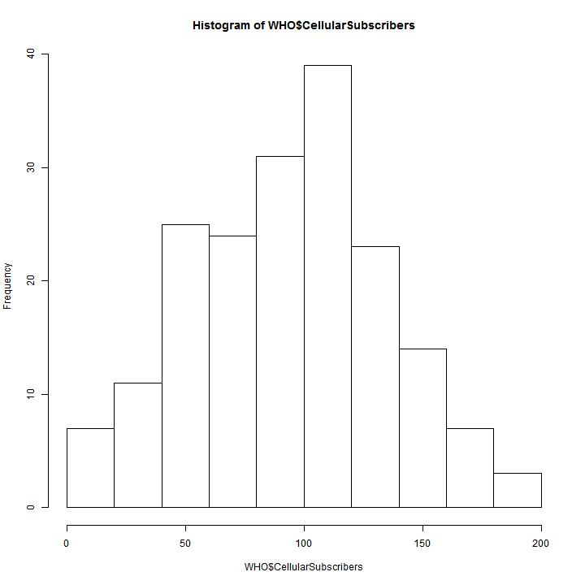

Data Science for Developers
========================================================
author: Padhu Ramalingam @pramalin
date: September 6th 2017
autosize: true

<style>
.reveal .slides section .slideContent {
   font-size: 20px;
}
</style>

Agenda
========================================================
* Motivation
* Basic Stats
* Machine Learning (small Data)
  + Tools
      - RStudio
      - Jupyter Notebook
      - Zeppelin
      - KNIME
      - Spreadsheet
  
* ML in Big Data
   - ML in Spark
   
* Deep Learning
    - Neural Networks
    - Deep Learning for Java (DL4J)


Motivation - 1
========================================================

CCA Spark and Hadoop Developer Exam (CCA175)

### Data Ingest
Transfer data between external systems and cluster.
  + Import data from database into HDFS using Sqoop
  + Export data to database from HDFS using Sqoop
  + Load data into and out of HDFS

### Transform, Stage, and Store
Convert data values stored in HDFS into a new data format.
  + Write results from an RDD back into HDFS using Spark
  + Read and write files in a variety of file formats
  + Perform standard ETL processes on data

### Data Analysis
Use Spark SQL.
  + Understand the fundamentals of querying datasets in Spark
  + Filter data using Spark
  + Join disparate datasets using Spark


Motivation - 2
========================================================
Big Data Analysis with Scala and Spark

* Week 1. Wikipedia Ranking - Count programming languages
* Week 2. StackOverflow - K Means Cluster - higher voted answers
* Week 3. 
* Week 4. Summarize [American Time Usage Survey] (https://www.kaggle.com/bls/american-time-use-survey) (Dataframe / SQL)

Machine Learning APIs are _not_ covered. 

Machine Learning Algorithms
========================================================
**Supervised Learning**
  + Regression
    - *Linear Regression*
    - *Logistic Regression*
  
  + Classification
    - *Classification and Regression Trees*
    - *Naive Bayes*
    - *Support Vector Machine*
  
**Unsupervised Learning**
  + Clustering
    - *Hierarchical Clustering*
    - *K-Means Clustering*


ML Algorithms & Applications
========================================================

| Algorithm | Application Examples | Assignments |
|-----------|----------------------|-------------|
|	Linear Regression |  Wine, Moneyball | Is Climate Change caused by human, predicting test score, Detecting Flu epidemic via search queries, Predicting Life expectancy from State data |
|	Logistic Regression | Modeling an Expert, The Framingham Heart Study, Election forecasting | Predict popularity of a song, Predicting Parole Violators, Predicting Loan Repayment, Predicting Baseball World Series Champion |
|	Trees	| Predicting Supreme Court Decisions, The D2Hawkeye Story (Predict health care cost) | Social Experiment - Understanding why people vote, Letter recognition, Predict earning from Census data,   |
|	Text Analytics	| Turning Tweets into Knowledge, IBM Watson | Detecting vandalism on Wikipedia, Automating reviews in medicine (is it clinical trial?), seperating Spam, |
|	Clustering	| Recommendation Systems, Predictive Diagnosis | Automatically Tagging blog articles, Market segmentation for Airlines, Predicting stock returns (clustering + regression) |
|	Linear Optimization	| Airline Revenue Management, Radiation Therapy | Investment management, Outsourcing strategy in Italian textiles, Gasoline blending, Farm produce sales strategy |
|	Integer Optimization| Sports Scheduling, eHarmony, operating room scheduler | Selecting profitable hotel sites, Assigning Sales regions, class assignments in elementary school  |

Data Structures
========================================================

# $Data Structures + Algorithms = Programs$
   Niklaus Wirth


Basic Calculations
========================================================

```r
8*6
```

```
[1] 48
```

```r
2^16
```

```
[1] 65536
```

Functions
========================================================

```r
sqrt(2)
```

```
[1] 1.414214
```

```r
abs(-65)
```

```
[1] 65
```

Variables (Scalar)
========================================================

```r
SquareRoot2 = sqrt(2)
# or SquareRoot2 <- sqrt(2)
```


Vectors
========================================================

```r
Country = c("Brazil", "China", "India","Switzerland","USA")
LifeExpectancy = c(74,76,65,83,79)
Country
```

```
[1] "Brazil"      "China"       "India"       "Switzerland" "USA"        
```

```r
LifeExpectancy
```

```
[1] 74 76 65 83 79
```

```r
Country[1]
```

```
[1] "Brazil"
```

```r
LifeExpectancy[3]
```

```
[1] 65
```

```r
Sequence = seq(0,100,2)
Sequence
```

```
 [1]   0   2   4   6   8  10  12  14  16  18  20  22  24  26  28  30  32
[18]  34  36  38  40  42  44  46  48  50  52  54  56  58  60  62  64  66
[35]  68  70  72  74  76  78  80  82  84  86  88  90  92  94  96  98 100
```

Data Frames
========================================================

```r
CountryData = data.frame(Country, LifeExpectancy) # constructed with vectors
CountryData
```

```
      Country LifeExpectancy
1      Brazil             74
2       China             76
3       India             65
4 Switzerland             83
5         USA             79
```

```r
CountryData$Population = c(199000,1390000,1240000,7997,318000) # insert new column
CountryData
```

```
      Country LifeExpectancy Population
1      Brazil             74     199000
2       China             76    1390000
3       India             65    1240000
4 Switzerland             83       7997
5         USA             79     318000
```

```r
Country = c("Australia","Greece")
LifeExpectancy = c(82,81)
Population = c(23050,11125)
NewCountryData = data.frame(Country, LifeExpectancy, Population) # construct another DF
#NewCountryData
AllCountryData = rbind(CountryData, NewCountryData) # append
AllCountryData
```

```
      Country LifeExpectancy Population
1      Brazil             74     199000
2       China             76    1390000
3       India             65    1240000
4 Switzerland             83       7997
5         USA             79     318000
6   Australia             82      23050
7      Greece             81      11125
```


Loading CSV Files
========================================================


```r
WHO = read.csv("WHO.csv")
str(WHO)
```

```
'data.frame':	194 obs. of  10 variables:
 $ Country            : Factor w/ 194 levels "Afghanistan",..: 1 2 3 4 5 6 7 8 9 10 ...
 $ Region             : Factor w/ 6 levels "Africa","Americas",..: 3 4 1 4 1 2 2 4 6 4 ...
 $ Population         : int  29825 3162 38482 78 20821 89 41087 2969 23050 8464 ...
 $ Under15            : num  47.4 21.3 27.4 15.2 47.6 ...
 $ Over60             : num  3.82 14.93 7.17 22.86 3.84 ...
 $ FertilityRate      : num  5.4 1.75 2.83 NA 6.1 2.12 2.2 1.74 1.89 1.44 ...
 $ LifeExpectancy     : int  60 74 73 82 51 75 76 71 82 81 ...
 $ CellularSubscribers: num  54.3 96.4 99 75.5 48.4 ...
 $ LiteracyRate       : num  NA NA NA NA 70.1 99 97.8 99.6 NA NA ...
 $ GNI                : num  1140 8820 8310 NA 5230 ...
```

Stats Summary
========================================================


```r
summary(WHO)
```

```
                Country                      Region     Population     
 Afghanistan        :  1   Africa               :46   Min.   :      1  
 Albania            :  1   Americas             :35   1st Qu.:   1696  
 Algeria            :  1   Eastern Mediterranean:22   Median :   7790  
 Andorra            :  1   Europe               :53   Mean   :  36360  
 Angola             :  1   South-East Asia      :11   3rd Qu.:  24535  
 Antigua and Barbuda:  1   Western Pacific      :27   Max.   :1390000  
 (Other)            :188                                               
    Under15          Over60      FertilityRate   LifeExpectancy 
 Min.   :13.12   Min.   : 0.81   Min.   :1.260   Min.   :47.00  
 1st Qu.:18.72   1st Qu.: 5.20   1st Qu.:1.835   1st Qu.:64.00  
 Median :28.65   Median : 8.53   Median :2.400   Median :72.50  
 Mean   :28.73   Mean   :11.16   Mean   :2.941   Mean   :70.01  
 3rd Qu.:37.75   3rd Qu.:16.69   3rd Qu.:3.905   3rd Qu.:76.00  
 Max.   :49.99   Max.   :31.92   Max.   :7.580   Max.   :83.00  
                                 NA's   :11                     
 CellularSubscribers  LiteracyRate        GNI       
 Min.   :  2.57      Min.   :31.10   Min.   :  340  
 1st Qu.: 63.57      1st Qu.:71.60   1st Qu.: 2335  
 Median : 97.75      Median :91.80   Median : 7870  
 Mean   : 93.64      Mean   :83.71   Mean   :13321  
 3rd Qu.:120.81      3rd Qu.:97.85   3rd Qu.:17558  
 Max.   :196.41      Max.   :99.80   Max.   :86440  
 NA's   :10          NA's   :91      NA's   :32     
```
## $$sd = \sqrt{\frac{1}{N-1} \sum_{i=1}^N (x_i - \overline{x})^2}$$

Basic data analysis
========================================================

```r
#Q:What is the mean value of the "Over60" variable?
mean(WHO$Over60)
```

```
[1] 11.16366
```

```r
#Q:Which country has the smallest percentage of the population over 60?
which.min(WHO$Over60)
```

```
[1] 183
```

```r
WHO$Country[183]
```

```
[1] United Arab Emirates
194 Levels: Afghanistan Albania Algeria Andorra ... Zimbabwe
```

```r
#Q:Which country has the largest literacy rate?
WHO$Country[which.max(WHO$LiteracyRate)]
```

```
[1] Cuba
194 Levels: Afghanistan Albania Algeria Andorra ... Zimbabwe
```
Vizualization - Histograms
========================================================

```r
hist(WHO$CellularSubscribers)
```



Vizualization -  Box plot
========================================================

```r
boxplot(WHO$LifeExpectancy ~ WHO$Region, xlab = "", ylab = "Life Expectancy", main = "Life Expectancy of Countries by Region")
```


Vizualization -  Summary Tables
========================================================

```r
table(WHO$Region)
```

```

               Africa              Americas Eastern Mediterranean 
                   46                    35                    22 
               Europe       South-East Asia       Western Pacific 
                   53                    11                    27 
```

```r
tapply(WHO$LifeExpectancy, WHO$Region, mean)
```

```
               Africa              Americas Eastern Mediterranean 
             57.95652              74.34286              69.59091 
               Europe       South-East Asia       Western Pacific 
             76.73585              69.36364              72.33333 
```

```r
#tapply(WHO$LiteracyRate, WHO$Region, min, na.rm=TRUE)
```

Linear Regression
========================================================
# $$\hat{y} = a_0 + a_1 * x_1 + a_2 * x_2 + ...$$

```r
# best fit line - y = 3x + 2 
x<-c(0,1,1)
y<-c(2,2,8)

plot(x,y,xlim = c(-3,3),ylim = c(0,10),pch=19)

#Baseline prediction
abline(h=mean(y),col="red",lwd=2)
text(-2,5,labels="Y=4,Baseline Prediction",cex=2)

#first fit the Linear model
fit1<-lm(y~x)
abline(lm(y~x),lwd=2,col="blue")
text(1.5,9,labels="Regression Line",cex = 2)
```


Linear Regression - Correlation
========================================================

**What is the baseline prediction?**
 
 *4*

**What is the Sum of Squared Errors (SSE) ?**

  *SSE = 0^2 + 3^2 + 3^2 = 18*

**What is the Total Sum of Squares (SST) ?**
 
  *SST = (2 - 4)^2 + (2 - 4)^2 + (8 - 4)^2 = 24*

**What is the R^2 of the model?**
 
  *R^2 = 1 - SSE/SST*
  
  *R^2 = 1 - 18/24 = 0.25.*

Wine Quality
========================================================
 [Video] https://www.youtube.com/watch?v=vI3envXmyDs

```r
wine = read.csv("Wine.csv")
str(wine)
```

```
'data.frame':	25 obs. of  7 variables:
 $ Year       : int  1952 1953 1955 1957 1958 1959 1960 1961 1962 1963 ...
 $ Price      : num  7.5 8.04 7.69 6.98 6.78 ...
 $ WinterRain : int  600 690 502 420 582 485 763 830 697 608 ...
 $ AGST       : num  17.1 16.7 17.1 16.1 16.4 ...
 $ HarvestRain: int  160 80 130 110 187 187 290 38 52 155 ...
 $ Age        : int  31 30 28 26 25 24 23 22 21 20 ...
 $ FrancePop  : num  43184 43495 44218 45152 45654 ...
```


Wine Quality - Summary
========================================================

```r
summary(wine)
```

```
      Year          Price         WinterRain         AGST      
 Min.   :1952   Min.   :6.205   Min.   :376.0   Min.   :14.98  
 1st Qu.:1960   1st Qu.:6.519   1st Qu.:536.0   1st Qu.:16.20  
 Median :1966   Median :7.121   Median :600.0   Median :16.53  
 Mean   :1966   Mean   :7.067   Mean   :605.3   Mean   :16.51  
 3rd Qu.:1972   3rd Qu.:7.495   3rd Qu.:697.0   3rd Qu.:17.07  
 Max.   :1978   Max.   :8.494   Max.   :830.0   Max.   :17.65  
  HarvestRain         Age         FrancePop    
 Min.   : 38.0   Min.   : 5.0   Min.   :43184  
 1st Qu.: 89.0   1st Qu.:11.0   1st Qu.:46584  
 Median :130.0   Median :17.0   Median :50255  
 Mean   :148.6   Mean   :17.2   Mean   :49694  
 3rd Qu.:187.0   3rd Qu.:23.0   3rd Qu.:52894  
 Max.   :292.0   Max.   :31.0   Max.   :54602  
```

Wine Quality - Model 1
========================================================

```r
model1<-lm(Price ~ AGST, data=wine)
summary(model1)
```

```

Call:
lm(formula = Price ~ AGST, data = wine)

Residuals:
     Min       1Q   Median       3Q      Max 
-0.78450 -0.23882 -0.03727  0.38992  0.90318 

Coefficients:
            Estimate Std. Error t value Pr(>|t|)    
(Intercept)  -3.4178     2.4935  -1.371 0.183710    
AGST          0.6351     0.1509   4.208 0.000335 ***
---
Signif. codes:  0 '***' 0.001 '**' 0.01 '*' 0.05 '.' 0.1 ' ' 1

Residual standard error: 0.4993 on 23 degrees of freedom
Multiple R-squared:  0.435,	Adjusted R-squared:  0.4105 
F-statistic: 17.71 on 1 and 23 DF,  p-value: 0.000335
```

Wine Quality - Model 1 Errors
========================================================

```r
# Sum of Squared Errors
model1$residuals
```

```
          1           2           3           4           5           6 
 0.04204258  0.82983774  0.21169394  0.15609432 -0.23119140  0.38991701 
          7           8           9          10          11          12 
-0.48959140  0.90318115  0.45372410  0.14887461 -0.23882157 -0.08974238 
         13          14          15          16          17          18 
 0.66185660 -0.05211511 -0.62726647 -0.74714947  0.42113502 -0.03727441 
         19          20          21          22          23          24 
 0.10685278 -0.78450270 -0.64017590 -0.05508720 -0.67055321 -0.22040381 
         25 
 0.55866518 
```

```r
SSE<-sum(model1$residuals^2)
SSE
```

```
[1] 5.734875
```

Wine Quality - Model 2
========================================================

```r
# Linear Regression (two variables)
model2<-lm(Price ~ AGST + HarvestRain, data=wine)
summary(model2)
```

```

Call:
lm(formula = Price ~ AGST + HarvestRain, data = wine)

Residuals:
     Min       1Q   Median       3Q      Max 
-0.88321 -0.19600  0.06178  0.15379  0.59722 

Coefficients:
            Estimate Std. Error t value Pr(>|t|)    
(Intercept) -2.20265    1.85443  -1.188 0.247585    
AGST         0.60262    0.11128   5.415 1.94e-05 ***
HarvestRain -0.00457    0.00101  -4.525 0.000167 ***
---
Signif. codes:  0 '***' 0.001 '**' 0.01 '*' 0.05 '.' 0.1 ' ' 1

Residual standard error: 0.3674 on 22 degrees of freedom
Multiple R-squared:  0.7074,	Adjusted R-squared:  0.6808 
F-statistic: 26.59 on 2 and 22 DF,  p-value: 1.347e-06
```

```r
# Sum of Squared Errors
SSE<-sum(model2$residuals^2)
SSE
```

```
[1] 2.970373
```

Wine Quality - Model 3
========================================================

```r
# Linear Regression (all variables)
model3<-lm(Price ~ AGST + HarvestRain + WinterRain + Age + FrancePop, data=wine)
summary(model3)
```

```

Call:
lm(formula = Price ~ AGST + HarvestRain + WinterRain + Age + 
    FrancePop, data = wine)

Residuals:
     Min       1Q   Median       3Q      Max 
-0.48179 -0.24662 -0.00726  0.22012  0.51987 

Coefficients:
              Estimate Std. Error t value Pr(>|t|)    
(Intercept) -4.504e-01  1.019e+01  -0.044 0.965202    
AGST         6.012e-01  1.030e-01   5.836 1.27e-05 ***
HarvestRain -3.958e-03  8.751e-04  -4.523 0.000233 ***
WinterRain   1.043e-03  5.310e-04   1.963 0.064416 .  
Age          5.847e-04  7.900e-02   0.007 0.994172    
FrancePop   -4.953e-05  1.667e-04  -0.297 0.769578    
---
Signif. codes:  0 '***' 0.001 '**' 0.01 '*' 0.05 '.' 0.1 ' ' 1

Residual standard error: 0.3019 on 19 degrees of freedom
Multiple R-squared:  0.8294,	Adjusted R-squared:  0.7845 
F-statistic: 18.47 on 5 and 19 DF,  p-value: 1.044e-06
```

```r
# Sum of Squared Errors
SSE<-sum(model3$residuals^2)
SSE
```

```
[1] 1.732113
```

Wine Quality - Model 4
========================================================

```r
# Remove FrancePop
model4<-lm(Price ~ AGST + HarvestRain + WinterRain + Age, data=wine)
summary(model4)
```

```

Call:
lm(formula = Price ~ AGST + HarvestRain + WinterRain + Age, data = wine)

Residuals:
     Min       1Q   Median       3Q      Max 
-0.45470 -0.24273  0.00752  0.19773  0.53637 

Coefficients:
              Estimate Std. Error t value Pr(>|t|)    
(Intercept) -3.4299802  1.7658975  -1.942 0.066311 .  
AGST         0.6072093  0.0987022   6.152  5.2e-06 ***
HarvestRain -0.0039715  0.0008538  -4.652 0.000154 ***
WinterRain   0.0010755  0.0005073   2.120 0.046694 *  
Age          0.0239308  0.0080969   2.956 0.007819 ** 
---
Signif. codes:  0 '***' 0.001 '**' 0.01 '*' 0.05 '.' 0.1 ' ' 1

Residual standard error: 0.295 on 20 degrees of freedom
Multiple R-squared:  0.8286,	Adjusted R-squared:  0.7943 
F-statistic: 24.17 on 4 and 20 DF,  p-value: 2.036e-07
```

```r
# Sum of Squared Errors
SSE<-sum(model4$residuals^2)
SSE
```

```
[1] 1.740162
```
Wine Quality - Multicollinearity
========================================================

```r
# Correlations
cor(wine) #correlation matrix 
```

```
                   Year      Price   WinterRain        AGST HarvestRain
Year         1.00000000 -0.4477679  0.016970024 -0.24691585  0.02800907
Price       -0.44776786  1.0000000  0.136650547  0.65956286 -0.56332190
WinterRain   0.01697002  0.1366505  1.000000000 -0.32109061 -0.27544085
AGST        -0.24691585  0.6595629 -0.321090611  1.00000000 -0.06449593
HarvestRain  0.02800907 -0.5633219 -0.275440854 -0.06449593  1.00000000
Age         -1.00000000  0.4477679 -0.016970024  0.24691585 -0.02800907
FrancePop    0.99448510 -0.4668616 -0.001621627 -0.25916227  0.04126439
                    Age    FrancePop
Year        -1.00000000  0.994485097
Price        0.44776786 -0.466861641
WinterRain  -0.01697002 -0.001621627
AGST         0.24691585 -0.259162274
HarvestRain -0.02800907  0.041264394
Age          1.00000000 -0.994485097
FrancePop   -0.99448510  1.000000000
```

```r
model5<-lm(Price ~ AGST + HarvestRain + WinterRain, data=wine) # Remove Age and FrancePop as they were highly  correlated
summary(model5)
```

```

Call:
lm(formula = Price ~ AGST + HarvestRain + WinterRain, data = wine)

Residuals:
     Min       1Q   Median       3Q      Max 
-0.67472 -0.12958  0.01973  0.20751  0.63846 

Coefficients:
              Estimate Std. Error t value Pr(>|t|)    
(Intercept) -4.3016263  2.0366743  -2.112 0.046831 *  
AGST         0.6810242  0.1117011   6.097 4.75e-06 ***
HarvestRain -0.0039481  0.0009987  -3.953 0.000726 ***
WinterRain   0.0011765  0.0005920   1.987 0.060097 .  
---
Signif. codes:  0 '***' 0.001 '**' 0.01 '*' 0.05 '.' 0.1 ' ' 1

Residual standard error: 0.345 on 21 degrees of freedom
Multiple R-squared:  0.7537,	Adjusted R-squared:  0.7185 
F-statistic: 21.42 on 3 and 21 DF,  p-value: 1.359e-06
```

```r
#removing both Age & FrancePop results in lowering of R-squared. We should remove FrancePop as intuitively Age of Wine is a better predictor of Price of Wine
```

Wine Quality - Predictions
========================================================

```r
# Read in test set
wineTest<-read.csv("WineTest.csv")
str(wineTest)
```

```
'data.frame':	2 obs. of  7 variables:
 $ Year       : int  1979 1980
 $ Price      : num  6.95 6.5
 $ WinterRain : int  717 578
 $ AGST       : num  16.2 16
 $ HarvestRain: int  122 74
 $ Age        : int  4 3
 $ FrancePop  : num  54836 55110
```

```r
# Make test set predictions using predict()
predictTest<-predict(model4, newdata=wineTest)
predictTest
```

```
       1        2 
6.768925 6.684910 
```

```r
# Compute R-squared
SSE<-sum((wineTest$Price - predictTest)^2)
SST<-sum((wineTest$Price - mean(wine$Price))^2)
1 - SSE/SST
```

```
[1] 0.7944278
```

Logistic Regression
========================================================

# $P(y=1)=\frac{1}{1 + e^{-(\beta_0 + \beta_1 x_1 + \beta_2 x_2)}}$
# $=\frac{1}{1 + e^{-logit}}$


Clustring
========================================================
   [Analytics Edge Course Material] (file:///C:/home/presentations/ml-jaxjug/Unit6_Clustering.html)


Big Data (pySpark)
========================================================
   [PySpark code] (file:///C:/home/presentations/ml-jaxjug/classification.py)

pySpark - compared to R
========================================================

```r
weather = read.csv("daily_weather.csv")

#str(weather)
#summary(weather)
weather$low_humidity_day = as.numeric(weather$relative_humidity_3pm < 25)

library(caTools)
library(rpart)
library(rpart.plot)

set.seed(12345) # to get the same split everytime
spl = sample.split(weather$low_humidity_day, SplitRatio = 0.8)
train = subset(weather, spl==TRUE)
test = subset(weather, spl==FALSE)

weatherTree = rpart(low_humidity_day ~ air_pressure_9am + air_temp_9am + avg_wind_direction_9am + avg_wind_speed_9am + max_wind_direction_9am + max_wind_speed_9am + rain_accumulation_9am + rain_duration_9am, data=weather, method="class", minbucket=20)
# prp(weatherTree)

predictWeather = predict(weatherTree, newdata = test, type="class")
cmat = table(test$low_humidity_day, predictWeather)
cmat
```

```
   predictWeather
     0  1
  0 94 15
  1 20 90
```

```r
(cmat[1,1] + cmat[2,2])/sum(cmat)
```

```
[1] 0.8401826
```

