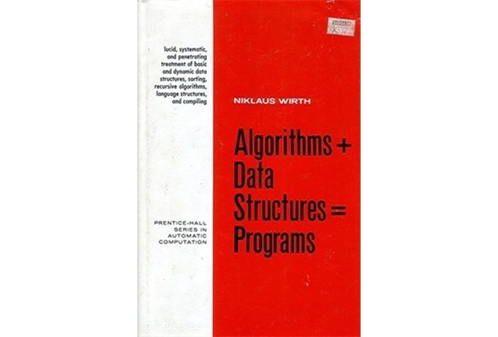

Data Science for Developers
========================================================
author: Padhu Ramalingam @pramalin
date: September 6th 2017
autosize: true

Agenda
========================================================
Motivation
ML Algorithms


Motivation - 1
========================================================

CCA Spark and Hadoop Developer Exam (CCA175) Price: USD $295

### Data Ingest
The skills to transfer data between external systems and your cluster. This includes the following:
  + Import data from a MySQL database into HDFS using Sqoop
  + Export data to a MySQL database from HDFS using Sqoop
  + Change the delimiter and file format of data during import using Sqoop
  + Ingest real-time and near-real-time streaming data into HDFS
  + Process streaming data as it is loaded onto the cluster
  + Load data into and out of HDFS using the Hadoop File System commands

### Transform, Stage, and Store
Convert a set of data values in a given format stored in HDFS into new data values or a new data format and write them into HDFS.
  + Load RDD data from HDFS for use in Spark applications
  + Write the results from an RDD back into HDFS using Spark
  + Read and write files in a variety of file formats
  + Perform standard extract, transform, load (ETL) processes on data

### Data Analysis
Use Spark SQL to interact with the metastore programmatically in your applications. Generate reports by using queries against loaded data.
  + Use metastore tables as an input source or an output sink for Spark applications
  + Understand the fundamentals of querying datasets in Spark
  + Filter data using Spark
  + Write queries that calculate aggregate statistics
  + Join disparate datasets using Spark
  + Produce ranked or sorted data


Motivation - 2
========================================================
Big Data Analysis with Scala and Spark

* Week 1. Wikipedia Ranking - Count programming languages
* Week 2. StackOverflow - K Means Cluster - higher voted answers
* Week 3. 
* Week 4. Summarize [American Time Usage Survey] (https://www.kaggle.com/bls/american-time-use-survey) (Dataframe / SQL)

Machine Learning APIs _not_ covered. 

Machine Learning Algorithms
========================================================
Supervised Learning
  * Regression
    + Linear Regression
    + Logistic Regression
  
  * Classification
    + Classification and Regression Trees
    + Naive Bayes
    + Support Vector Machine
  
Unsupervised Learning
  * Clustering
    + Hierarchical Clustering
    + K-Means Clustering


ML Algorithms & Applications
========================================================

| Algorithm | Application Examples | Assignments |
|-----------|----------------------|-------------|
|	Linear Regression |  Wine, Moneyball | Is Climate Change caused by human, predicting test score, Detecting Flu epidemic via search queries, Predicting Life expectancy from State data |
|	Logistic Regression | Modeling an Expert, The Framingham Heart Study, Election forecasting | Predict popularity of a song, Predicting Parole Violators, Predicting Loan Repayment, Predicting Baseball World Series Champion |
|	Trees	| Predicting Supreme Court Decisions, The D2Hawkeye Story (Predict health care cost) | Social Experiment - Understanding why people vote, Letter recognition, Predict earning from Census data,   |
|	Text Analytics	| Turning Tweets into Knowledge, IBM Watson | Detecting vandalism on Wikipedia, Automating reviews in medicine (is it clinical trial?), seperating Spam, |
|	Clustering	| Recommendation Systems, Predictive Diagnosis | Automatically Tagging blog articles, Market segmentation for Airlines, Predicting stock returns (clustering + regression) |
|	Linear Optimization	| Airline Revenue Management, Radiation Therapy | Investment management, Outsourcing strategy in Italian textiles, Gasoline blending, Farm produce sales strategy |
|	Integer Optimization| Sports Scheduling, eHarmony, operating room scheduler | Selecting profitable hotel sites, Assigning Sales regions, class assignments in elementary school  |

Data Structures
========================================================

# $Data Structures + Algorithms = Programs$
   Niklaus Wirth


Basic Calculations
========================================================

```r
8*6
```

```
[1] 48
```

```r
2^16
```

```
[1] 65536
```

Functions
========================================================

```r
sqrt(2)
```

```
[1] 1.414214
```

```r
abs(-65)
```

```
[1] 65
```

Variables
========================================================

```r
SquareRoot2 = sqrt(2)
# or SquareRoot2 <- sqrt(2)
```


Vectors
========================================================

```r
Country = c("Brazil", "China", "India","Switzerland","USA")
LifeExpectancy = c(74,76,65,83,79)
Country
```

```
[1] "Brazil"      "China"       "India"       "Switzerland" "USA"        
```

```r
LifeExpectancy
```

```
[1] 74 76 65 83 79
```

```r
Country[1]
```

```
[1] "Brazil"
```

```r
LifeExpectancy[3]
```

```
[1] 65
```

```r
Sequence = seq(0,100,2)
Sequence
```

```
 [1]   0   2   4   6   8  10  12  14  16  18  20  22  24  26  28  30  32
[18]  34  36  38  40  42  44  46  48  50  52  54  56  58  60  62  64  66
[35]  68  70  72  74  76  78  80  82  84  86  88  90  92  94  96  98 100
```

Data Frames
========================================================

```r
CountryData = data.frame(Country, LifeExpectancy)
CountryData
```

```
      Country LifeExpectancy
1      Brazil             74
2       China             76
3       India             65
4 Switzerland             83
5         USA             79
```

```r
CountryData$Population = c(199000,1390000,1240000,7997,318000)
CountryData
```

```
      Country LifeExpectancy Population
1      Brazil             74     199000
2       China             76    1390000
3       India             65    1240000
4 Switzerland             83       7997
5         USA             79     318000
```

```r
Country = c("Australia","Greece")
LifeExpectancy = c(82,81)
Population = c(23050,11125)
NewCountryData = data.frame(Country, LifeExpectancy, Population)
NewCountryData
```

```
    Country LifeExpectancy Population
1 Australia             82      23050
2    Greece             81      11125
```

```r
AllCountryData = rbind(CountryData, NewCountryData)
AllCountryData
```

```
      Country LifeExpectancy Population
1      Brazil             74     199000
2       China             76    1390000
3       India             65    1240000
4 Switzerland             83       7997
5         USA             79     318000
6   Australia             82      23050
7      Greece             81      11125
```


Loading CSV Files
========================================================


```r
WHO = read.csv("WHO.csv")
str(WHO)
```

```
'data.frame':	194 obs. of  10 variables:
 $ Country            : Factor w/ 194 levels "Afghanistan",..: 1 2 3 4 5 6 7 8 9 10 ...
 $ Region             : Factor w/ 6 levels "Africa","Americas",..: 3 4 1 4 1 2 2 4 6 4 ...
 $ Population         : int  29825 3162 38482 78 20821 89 41087 2969 23050 8464 ...
 $ Under15            : num  47.4 21.3 27.4 15.2 47.6 ...
 $ Over60             : num  3.82 14.93 7.17 22.86 3.84 ...
 $ FertilityRate      : num  5.4 1.75 2.83 NA 6.1 2.12 2.2 1.74 1.89 1.44 ...
 $ LifeExpectancy     : int  60 74 73 82 51 75 76 71 82 81 ...
 $ CellularSubscribers: num  54.3 96.4 99 75.5 48.4 ...
 $ LiteracyRate       : num  NA NA NA NA 70.1 99 97.8 99.6 NA NA ...
 $ GNI                : num  1140 8820 8310 NA 5230 ...
```

Summary(Data Frame)
========================================================

```r
summary(WHO)
```

```
                Country                      Region     Population     
 Afghanistan        :  1   Africa               :46   Min.   :      1  
 Albania            :  1   Americas             :35   1st Qu.:   1696  
 Algeria            :  1   Eastern Mediterranean:22   Median :   7790  
 Andorra            :  1   Europe               :53   Mean   :  36360  
 Angola             :  1   South-East Asia      :11   3rd Qu.:  24535  
 Antigua and Barbuda:  1   Western Pacific      :27   Max.   :1390000  
 (Other)            :188                                               
    Under15          Over60      FertilityRate   LifeExpectancy 
 Min.   :13.12   Min.   : 0.81   Min.   :1.260   Min.   :47.00  
 1st Qu.:18.72   1st Qu.: 5.20   1st Qu.:1.835   1st Qu.:64.00  
 Median :28.65   Median : 8.53   Median :2.400   Median :72.50  
 Mean   :28.73   Mean   :11.16   Mean   :2.941   Mean   :70.01  
 3rd Qu.:37.75   3rd Qu.:16.69   3rd Qu.:3.905   3rd Qu.:76.00  
 Max.   :49.99   Max.   :31.92   Max.   :7.580   Max.   :83.00  
                                 NA's   :11                     
 CellularSubscribers  LiteracyRate        GNI       
 Min.   :  2.57      Min.   :31.10   Min.   :  340  
 1st Qu.: 63.57      1st Qu.:71.60   1st Qu.: 2335  
 Median : 97.75      Median :91.80   Median : 7870  
 Mean   : 93.64      Mean   :83.71   Mean   :13321  
 3rd Qu.:120.81      3rd Qu.:97.85   3rd Qu.:17558  
 Max.   :196.41      Max.   :99.80   Max.   :86440  
 NA's   :10          NA's   :91      NA's   :32     
```

Basic data analysis
========================================================
sd = $\sqrt{\frac{1}{N-1} \sum_{i=1}^N (x_i - \overline{x})^2}$
  


```r
mean(WHO$Under15)
```

```
[1] 28.73242
```

```r
sd(WHO$Under15)
```

```
[1] 10.53457
```

```r
summary(WHO$Under15)
```

```
   Min. 1st Qu.  Median    Mean 3rd Qu.    Max. 
  13.12   18.72   28.65   28.73   37.75   49.99 
```

```r
which.min(WHO$Under15)
```

```
[1] 86
```

```r
WHO$Country[86]
```

```
[1] Japan
194 Levels: Afghanistan Albania Algeria Andorra ... Zimbabwe
```

```r
which.max(WHO$Under15)
```

```
[1] 124
```

```r
WHO$Country[124]
```

```
[1] Niger
194 Levels: Afghanistan Albania Algeria Andorra ... Zimbabwe
```

Linear Regression
========================================================


Clustring
========================================================
   [Analytics Edge Course Material] (file:///C:/home/presentations/ml-jaxjug/Unit6_Clustering.html)


Big Data
========================================================
   [PySpark code] (file:///C:/home/presentations/ml-jaxjug/classification.py)

Big Data - compared to R
========================================================

```r
weather = read.csv("daily_weather.csv")

#str(weather)
#summary(weather)
weather$low_humidity_day = as.numeric(weather$relative_humidity_3pm < 25)

library(caTools)
library(rpart)
library(rpart.plot)

set.seed(12345) # to get the same split everytime
spl = sample.split(weather$low_humidity_day, SplitRatio = 0.8)
train = subset(weather, spl==TRUE)
test = subset(weather, spl==FALSE)

weatherTree = rpart(low_humidity_day ~ air_pressure_9am + air_temp_9am + avg_wind_direction_9am + avg_wind_speed_9am + max_wind_direction_9am + max_wind_speed_9am + rain_accumulation_9am + rain_duration_9am, data=weather, method="class", minbucket=20)
# prp(weatherTree)

predictWeather = predict(weatherTree, newdata = test, type="class")
cmat = table(test$low_humidity_day, predictWeather)
cmat
```

```
   predictWeather
     0  1
  0 94 15
  1 20 90
```

```r
(cmat[1,1] + cmat[2,2])/sum(cmat)
```

```
[1] 0.8401826
```

R Code
========================================================

```r
summary(cars)
```

```
     speed           dist       
 Min.   : 4.0   Min.   :  2.00  
 1st Qu.:12.0   1st Qu.: 26.00  
 Median :15.0   Median : 36.00  
 Mean   :15.4   Mean   : 42.98  
 3rd Qu.:19.0   3rd Qu.: 56.00  
 Max.   :25.0   Max.   :120.00  
```

Slide With Plot
========================================================


